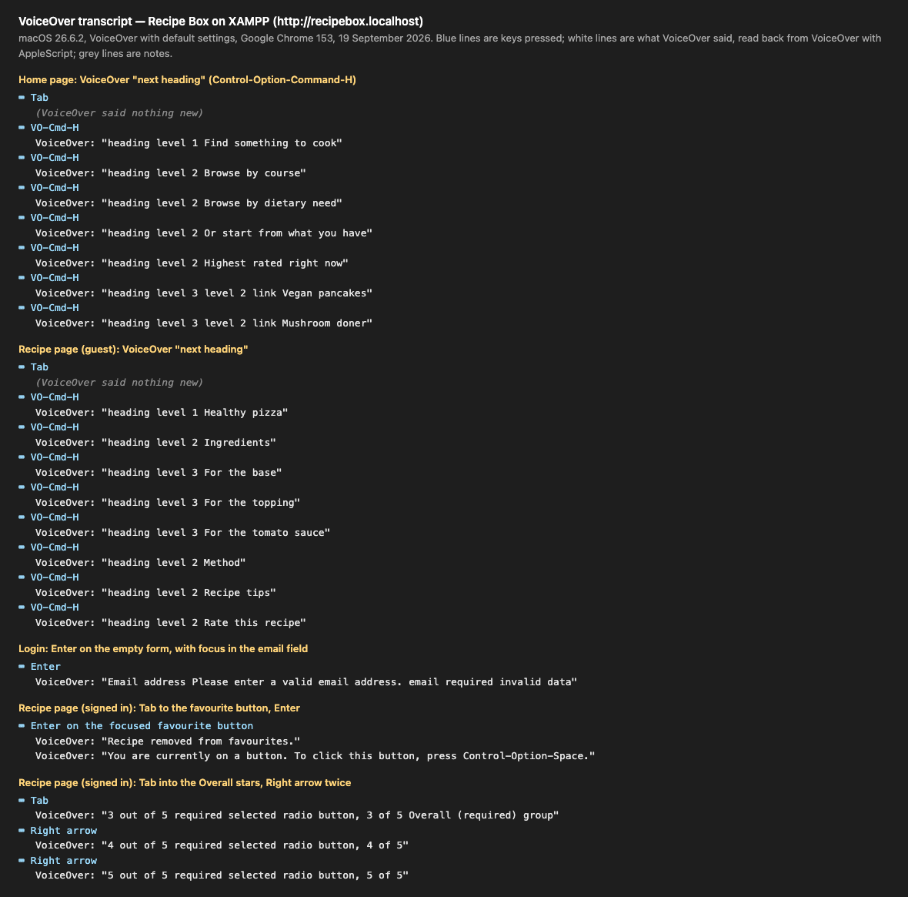
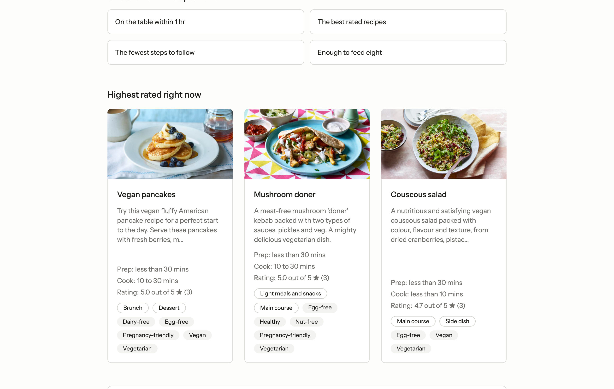
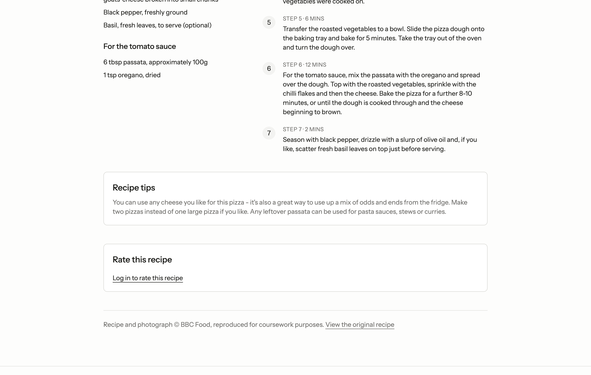
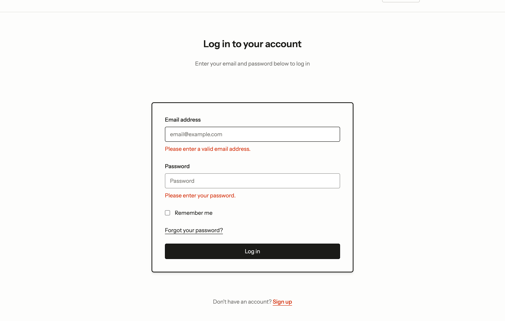
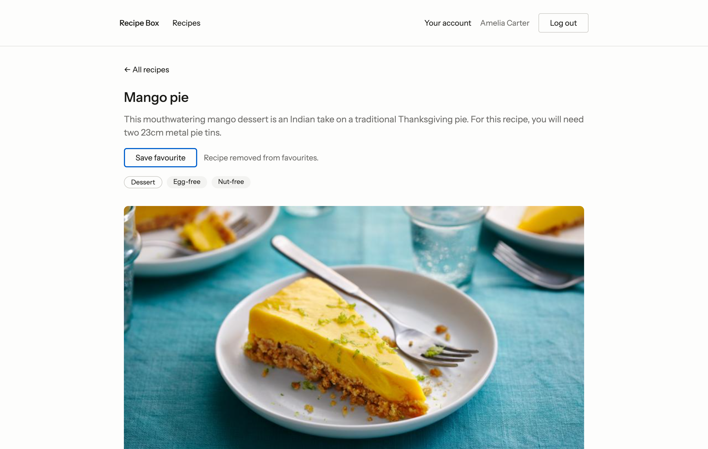
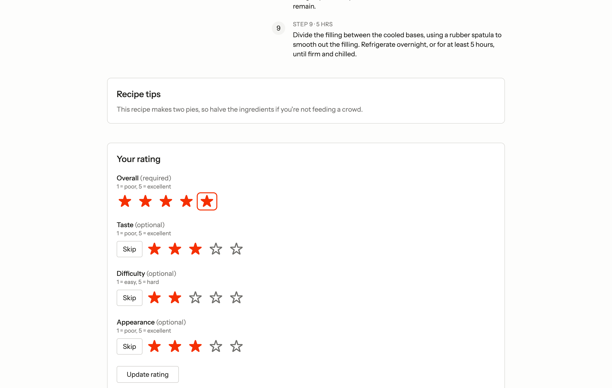
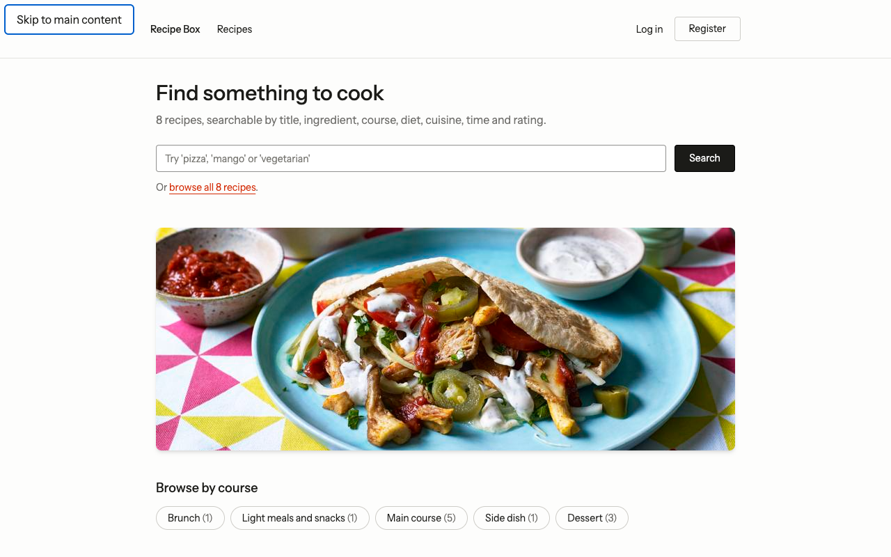
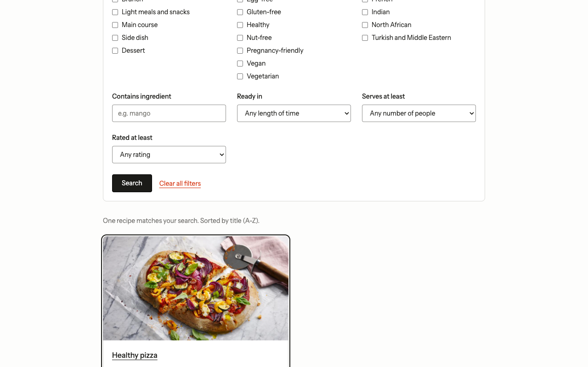
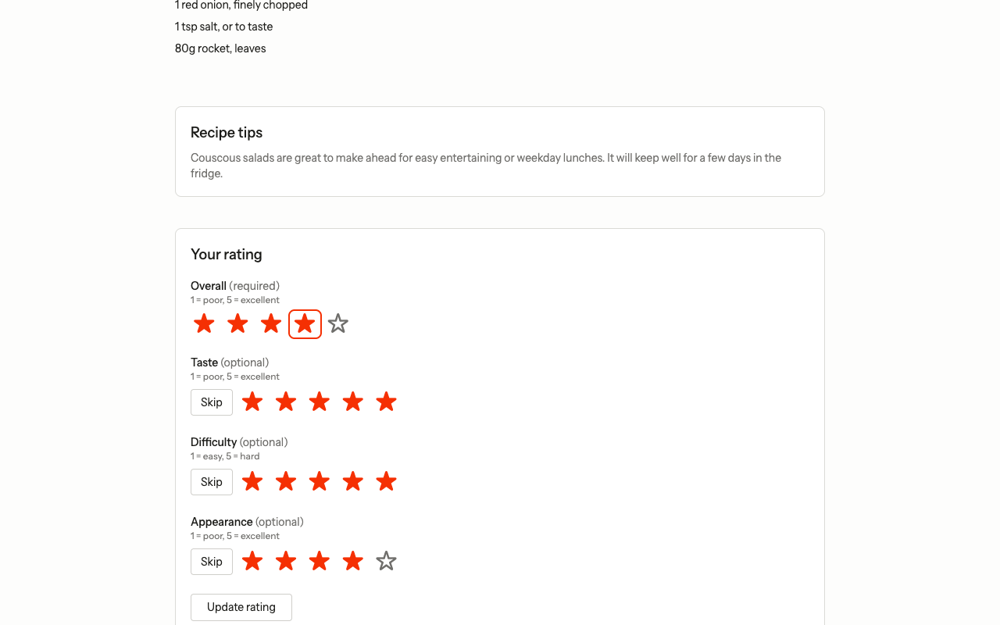
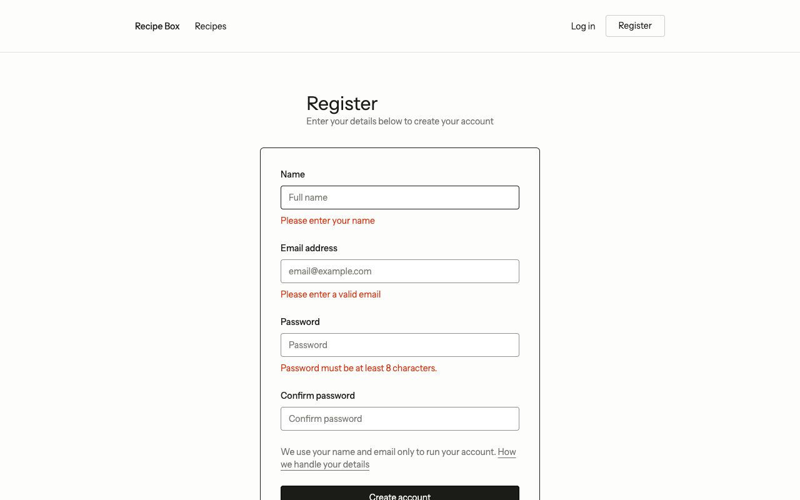

# Accessibility testing: VoiceOver and keyboard only

This records a screen-reader pass with **VoiceOver** and a **keyboard-only** pass through
Recipe Box, with the evidence for the report. It follows the automated axe and colour
contrast audits recorded in [status.md](status.md#quality-attributes).

| | |
| --- | --- |
| **Date** | 19 September 2026 |
| **Site tested** | Recipe Box on XAMPP, `http://recipebox.localhost` — see [xampp.md](xampp.md) |
| **Machine** | macOS 26.6.2, Apple M3 Max |
| **Screen reader** | VoiceOver (built into macOS), default settings |
| **Browser** | Google Chrome 153 |
| **Result** | Every VoiceOver scenario and all 15 keyboard steps behaved as intended. One usability finding: reaching the first search result takes 35 presses of Tab ([F1](#4-findings)). |
| **Still open** | The keyboard-only check by a person ([section 5](#5-keyboard-only-check-by-a-person)). |

## 1. What was tested, and how

| Part | How | Evidence |
| --- | --- | --- |
| **A. VoiceOver** | The real VoiceOver, driven by a script. Keys were sent at operating-system level through macOS System Events, exactly as a keyboard sends them, and after every key the script read back what VoiceOver had just said (VoiceOver's own `content of last phrase`, through AppleScript). VoiceOver kept its default settings. | [Section 2](#2-voiceover-results), transcripts in [`evidence/accessibility/voiceover/`](evidence/accessibility/voiceover) |
| **B. Keyboard only, scripted** | A Playwright script used only Tab, Enter, Space, arrow keys and typing on the page, took a screenshot at every step, and recorded the focused element's role and name as Chrome's accessibility tree reports them to screen readers. | [Section 3](#3-keyboard-only-results-scripted), [`evidence/accessibility/keyboard-steps.json`](evidence/accessibility/keyboard-steps.json) |
| **C. Accessibility tree** | The roles and names Chrome gives screen readers for nine pages and states, saved as text. | [`evidence/accessibility/accessibility-tree/`](evidence/accessibility/accessibility-tree) |
| **D. Keyboard only, by a person** | A checklist for a person to complete and sign. | [Section 5](#5-keyboard-only-check-by-a-person) |

The scripts that produced A and B are kept in
[`evidence/accessibility/scripts/`](evidence/accessibility/scripts) so the method can be
checked and repeated.

## 2. VoiceOver results

Quotes are exactly what VoiceOver said, as read back from VoiceOver.

| # | Scenario | What VoiceOver said | What it shows | Result |
| --- | --- | --- | --- | --- |
| V1 | Home page, "next heading" (Control-Option-Command-H) seven times | "heading level 1 Find something to cook", then "heading level 2 Browse by course", "…Browse by dietary need", "…Or start from what you have", "…Highest rated right now", then "heading level 3 level 2 link Vegan pancakes", "heading level 3 level 2 link Mushroom doner" | One `<h1>`, sections as `<h2>`, and each recipe card's title as an `<h3>` that is also a link, so a user can move by heading and open a recipe from its heading | Pass |
| V2 | Recipe page, "next heading" eight times | "heading level 1 Healthy pizza", "heading level 2 Ingredients", "heading level 3 For the base", "…For the topping", "…For the tomato sauce", "heading level 2 Method", "heading level 2 Recipe tips", "heading level 2 Rate this recipe" | A clean outline: ingredient groups sit under Ingredients as level 3 | Pass |
| V3 | Login, Enter on the empty form with focus in the email field | "Email address Please enter a valid email address. email required invalid data" | The field's label, **its error message** (linked with `aria-describedby`), its type, that it is required, and that it is **invalid** (`aria-invalid`), all in one announcement | Pass |
| V4 | Recipe page, signed in: Tab to the favourite button, then Enter | "**Recipe removed from favourites.**", then VoiceOver's usual hint for a button | The confirmation of an action done without a page reload is announced (the `role="status"` message), although the page does not change | Pass |
| V5 | Recipe page, signed in: Tab into the Overall rating, then Right arrow twice | "3 out of 5 required selected radio button, 3 of 5 Overall (required) group", then "4 out of 5 required selected radio button, 4 of 5", then "5 out of 5 … 5 of 5" | The star control is announced as ordinary radio buttons with a meaningful name, position and group label, although stars are shown on screen | Pass |

**Figure B.1** — The VoiceOver transcript for V1–V5. Blue lines are the keys pressed;
white lines are what VoiceOver said.

The page as it looked at the end of each scenario:

| | |
| --- | --- |
|  **B.2** V1, home page |  **B.3** V2, recipe page |
|  **B.4** V3, login errors |  **B.5** V4, favourite removed |
|  **B.6** V5, rating stars | |

## 3. Keyboard-only results (scripted)

Focus is shown as Chrome's accessibility tree reports it. "Page start" means a new page
had just opened, where the browser puts focus at the top of the document; the next Tab
reaches the skip link.

| Step | Keys | Focus afterwards | What it shows | Screenshot |
| --- | --- | --- | --- | --- |
| 1 | Home page, first Tab | link "Skip to main content" | The skip link appears on the first Tab | [B.7](images/accessibility/keyboard-01-skip-link.png) |
| 2 | Enter on the skip link, then Tab | searchbox "Search recipes" | The skip link jumps past the navigation | [B.8](images/accessibility/keyboard-02-after-skip-link.png) |
| 3 | Type "pizza" | searchbox "Search recipes" | Visible focus ring while typing | [B.9](images/accessibility/keyboard-03-search-typed.png) |
| 4 | Enter, then Tab 35 times | link "Healthy pizza" | The whole card is outlined; see finding F1 | [B.10](images/accessibility/keyboard-04-first-result.png) |
| 5 | Enter | page start | The recipe opens | [B.11](images/accessibility/keyboard-05-recipe-page.png) |
| 6 | Tab to the guest prompt | link "Log in to save this recipe" | Guests are offered a way in | [B.12](images/accessibility/keyboard-06-guest-login-link.png) |
| 7 | Enter | textbox "Email address" | The login page opens with the email field already focused | [B.13](images/accessibility/keyboard-07-login-autofocus.png) |
| 8 | Type email, Tab, type password | textbox "Password" | Fields are in a logical order | [B.14](images/accessibility/keyboard-08-login-filled.png) |
| 9 | Enter | page start | Logged in; the account page opens | [B.15](images/accessibility/keyboard-09-account-page.png) |
| 10 | Tab to the favourite button | button "Save favourite" | Visible focus ring | [B.16](images/accessibility/keyboard-10-favourite-focused.png) |
| 11 | Enter | button "Remove favourite" | Focus stays on the button while its label changes | [B.17](images/accessibility/keyboard-11-favourite-toggled.png) |
| 12 | Tab into the Overall stars, arrow keys | radio "4 out of 5", checked | Stars are operated with the arrow keys, with a visible focus ring | [B.18](images/accessibility/keyboard-12-rating-arrows.png) |
| 13 | Tab to the rating button, Enter | page start | "Your rating has been saved." | [B.19](images/accessibility/keyboard-13-rating-saved.png) |
| 14 | Tab to "Log out" | button "Log out" | Visible focus ring | [B.20](images/accessibility/keyboard-14-logout-focused.png) |
| 15 | Registration page, Enter on the empty form | textbox "Name", invalid | Every error shows, and focus moves to the first invalid field, linked to its message (`aria-invalid="true"`, `aria-describedby="nameError"`) | [B.21](images/accessibility/keyboard-15-register-errors.png) |

No step needed the mouse, focus was always visible, and focus never became trapped.

| | |
| --- | --- |
|  **B.7** Step 1, the skip link |  **B.10** Step 4, the whole card outlined |
|  **B.18** Step 12, stars by arrow keys |  **B.21** Step 15, errors and focus |

## 4. Findings

| # | Finding | Severity | Status |
| --- | --- | --- | --- |
| F1 | On the recipe listing, the whole search and filter form comes before the results, so reaching the first result from the search box takes **35 presses of Tab** (step 4). Screen-reader users can jump by heading instead, and the page is usable, but it is slow by keyboard. A "Skip to results" link after the search box, or collapsing the filters by default, would shorten it. | Usability, not a WCAG failure | Open |
| F2 | VoiceOver announces the home page's recipe cards as "heading level 3 level 2 link …". The heading level (3) is correct; the extra "level 2" is part of VoiceOver's announcement for the cards inside the list. | Observation | No change needed |
| F3 | No missing labels, unnamed controls, invisible focus, focus traps or unannounced errors were found in any scenario or step. | — | — |

## 5. Keyboard-only check by a person

To complete before submission. Use Chrome, and do **not** touch the mouse or trackpad.
Log in as `amelia@example.test` / `password` when asked. Mark each row, and note
anything that was confusing, slow or not announced.

| # | Task | Expected | Pass / Fail | Notes |
| --- | --- | --- | --- | --- |
| K1 | Open the home page and press Tab once | "Skip to main content" appears | | |
| K2 | Use the skip link, search for "salad", open a result | The recipe page opens | | |
| K3 | Log in from the recipe page's "Log in to save this recipe" link | The account page opens | | |
| K4 | Go back to a recipe; save it as a favourite | The button changes; focus stays on it | | |
| K5 | Rate the recipe with the arrow keys and save the rating | "Your rating has been saved." | | |
| K6 | Open "Your account"; open a saved recipe from its card | The recipe opens | | |
| K7 | Open the account settings; submit the password form empty | Errors show; focus moves to the first field | | |
| K8 | Log out | The home page shows "Log in" | | |
| K9 | Open "Forgot your password?" from the login page; submit an invalid email | An error shows next to the field | | |
| K10 | Throughout: was focus always visible, and could you always get where you wanted? | Yes | | |

**Tester:** ______________________ **Date:** ______________ **Browser and version:** ______________________

## 6. Problems during testing and how we solved them

For anyone repeating the VoiceOver pass on a Mac:

| # | Problem | Cause | Solution |
| --- | --- | --- | --- |
| T1 | A script cannot control VoiceOver at all | VoiceOver's AppleScript control is off by default, and with System Integrity Protection on it cannot be switched on from the command line | VoiceOver Utility → General → tick "Allow VoiceOver to be controlled with AppleScript" |
| T2 | Key presses sent by the script are ignored | The app running the script needs permission to control the computer | System Settings → Privacy & Security → Accessibility → add the terminal or IDE (here PhpStorm); accept the prompts to control VoiceOver and System Events |
| T3 | The Guidepup library could not start VoiceOver: "Failed to mount Guidepup preferences", then `EPERM … symlink … group.com.apple.VoiceOver` | Guidepup replaces VoiceOver's preference files with its own, inside a folder macOS protects; its automatic setup also needs SIP disabled | We did not weaken macOS security. We drove VoiceOver directly through its AppleScript interface, which also keeps VoiceOver's default settings, as a real user would have |
| T4 | VoiceOver kept talking after a failed run | A start that fails half way is not undone by Guidepup's stop | The scripts always end with "tell VoiceOver to quit" and then `pkill -x VoiceOver` |
| T5 | VoiceOver read the tester's own Chrome window | Both windows belong to "Google Chrome", and bringing Chrome forward by name picks either | The test Chrome is brought to the front by its process id through System Events |
| T6 | The first Tab went into Chrome's toolbar ("Bookmark this tab button") | Keyboard focus was in the browser's own controls, not the page | Put focus in the page before the scenario starts |
| T7 | Typing the email through System Events made Chrome open its password pop-up, and the email arrived incomplete | Chrome's autofill reacts to OS-level typing | Scenarios that need a signed-in user sign in as set-up, outside the recorded part |
| T8 | For "an email without a domain, then Enter", the recorded phrase was VoiceOver's usage hint, not the error | VoiceOver speaks its hint straight after the error, and the script reads only the latest phrase | The scenario was left out; V3 shows the same error announcement reliably |
| T9 | The arrow keys ended on a different star from the one intended | Arrow keys wrap around a radio group, and Tab enters the group at its checked star | Read the checked star first, then press Right the exact number of times |

## 7. Limitations

- **VoiceOver was driven by a script, not by a person using it every day.** It shows what
  VoiceOver says and that each task can be done, but not how pleasant it is for a
  regular screen-reader user.
- **One screen reader and one browser**: VoiceOver with Chrome on macOS. NVDA or JAWS on
  Windows, and Safari, were not tested.
- **Default VoiceOver settings.** Users who change verbosity or navigation settings may
  hear different wording.
- **The keyboard-only check by a person** ([section 5](#5-keyboard-only-check-by-a-person))
  is still to be done.

## 8. Evidence files

| Path | Contents |
| --- | --- |
| [`images/accessibility/`](images/accessibility) | The VoiceOver transcript (B.1), the page at the end of each VoiceOver scenario (B.2–B.6), and a screenshot of every keyboard step (B.7–B.21) |
| [`evidence/accessibility/voiceover/`](evidence/accessibility/voiceover) | The VoiceOver transcripts as text, one file per scenario |
| [`evidence/accessibility/keyboard-steps.json`](evidence/accessibility/keyboard-steps.json) | Every keyboard step: keys, focused element, screenshot |
| [`evidence/accessibility/accessibility-tree/`](evidence/accessibility/accessibility-tree) | Chrome's accessibility tree for nine pages and states |
| [`evidence/accessibility/scripts/`](evidence/accessibility/scripts) | The scripts that produced the evidence |
