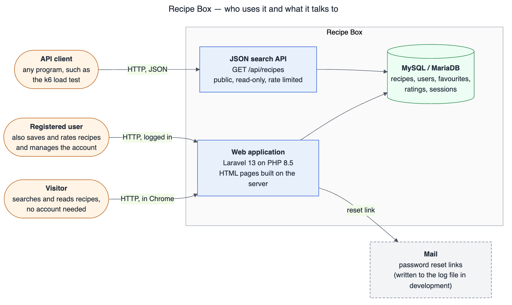
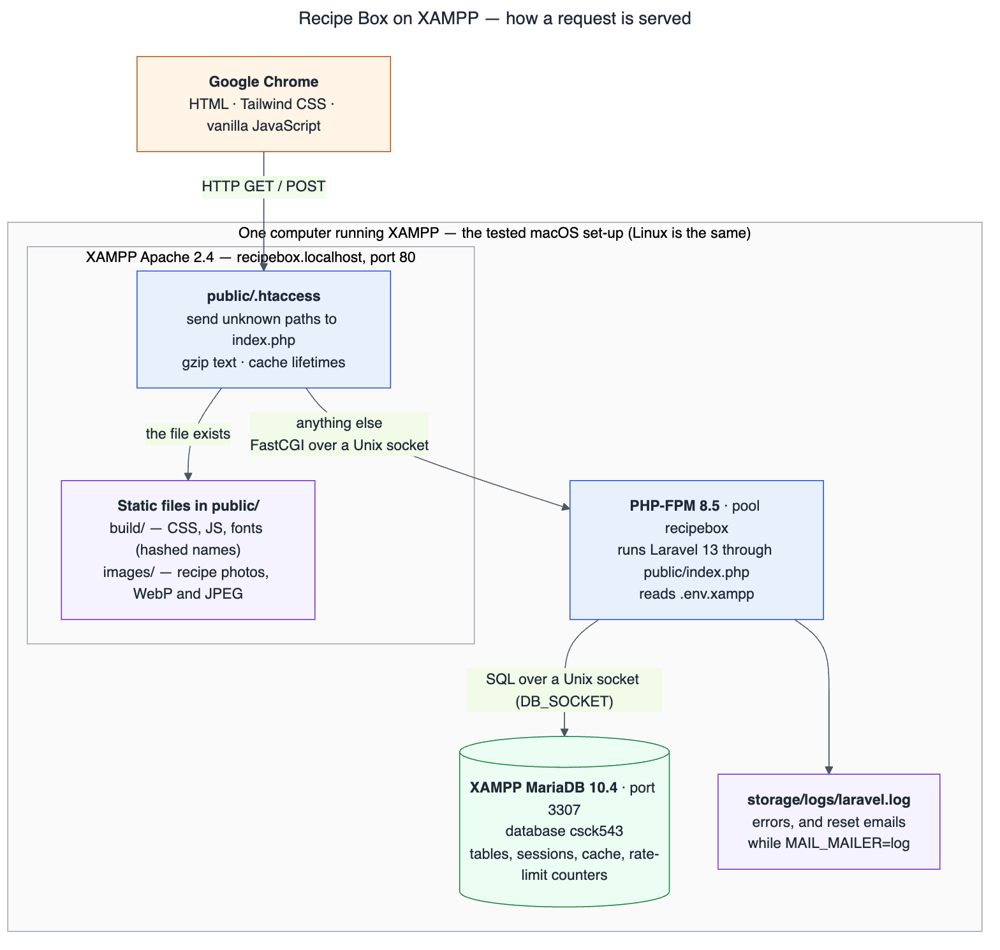
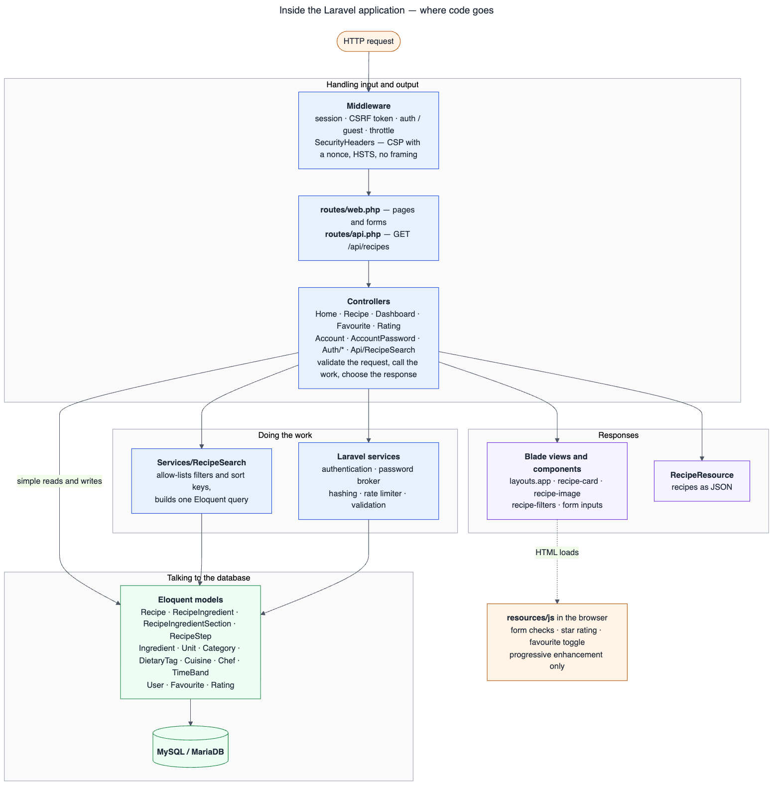
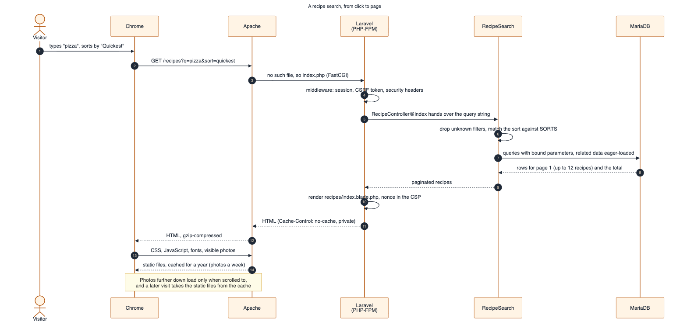
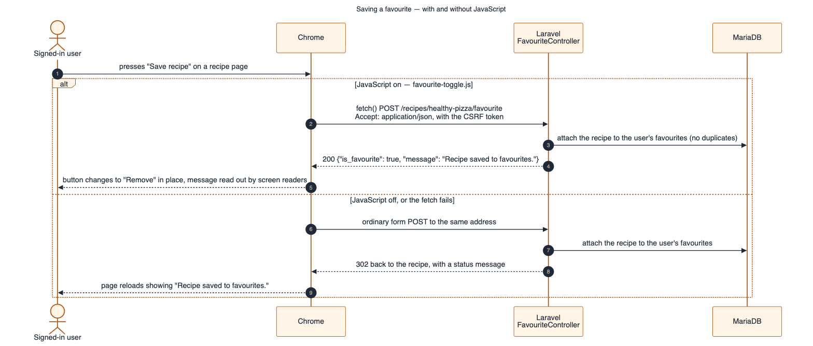
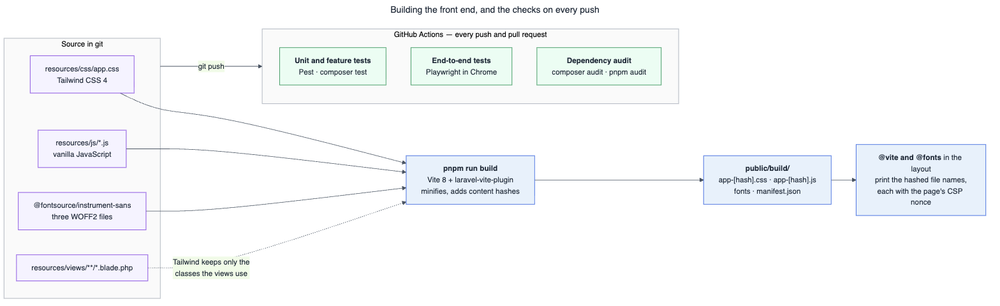
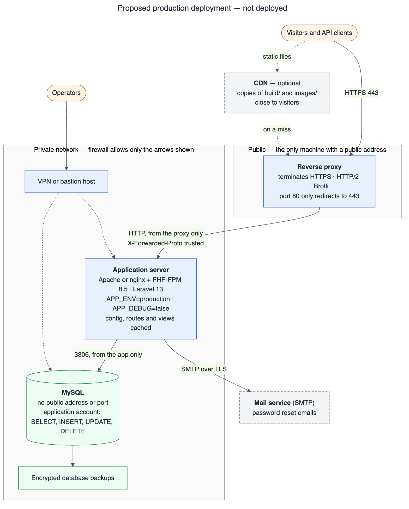
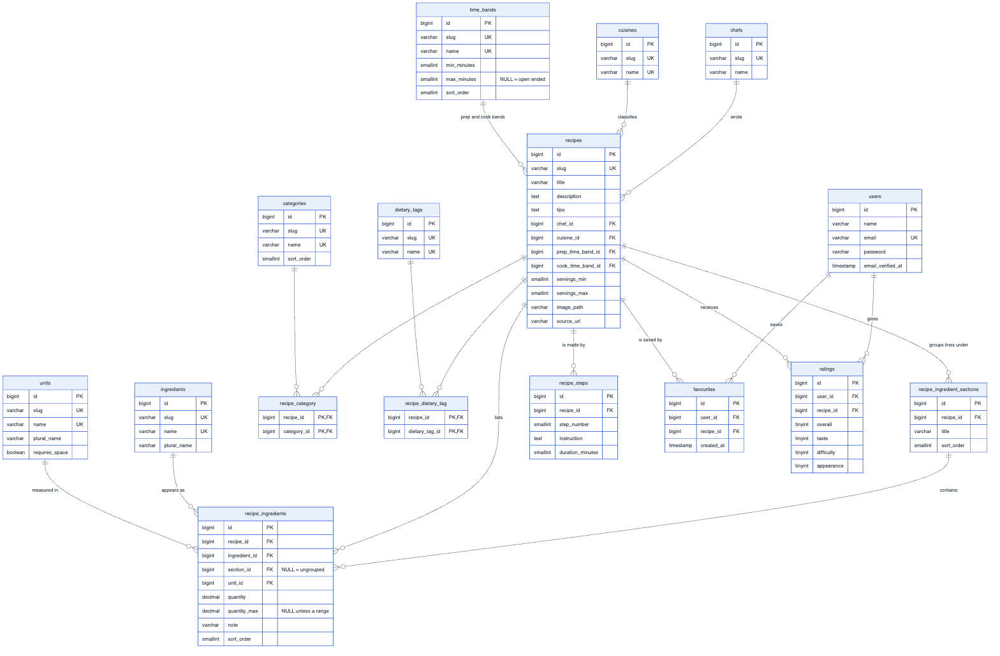

# Architecture diagrams

Eight diagrams of Recipe Box, from the widest view to the narrowest: who uses it, how it
runs on XAMPP, how the code is layered, how two typical requests travel through it, how
the front end is built and checked, how it would be deployed for real, and the
database. [architecture.md](architecture.md) then says which file does what.

Colours mean the same thing in every diagram:

| Colour | Meaning |
| --- | --- |
| Orange | People, and the browser |
| Blue | Our code and the servers that run it |
| Green | Data, and the checks that guard it |
| Purple | Files: static assets, views, logs, source |
| Dashed grey | Outside the project, or optional |

The diagrams are drawn with [Mermaid](https://mermaid.js.org/), a text format, so they
are kept in git beside the code and a change to one shows up in a normal diff. The
sources are in [`diagrams/`](diagrams); the pictures below are exported from them, as
PNG (shown here, and ready for the report) and SVG (sharp at any zoom). To change a
diagram, edit its `.mmd` file and export it again ([section 9](#9-changing-a-diagram)).

## 1. System context



[SVG](images/architecture/1-system-context.svg) · [source](diagrams/1-system-context.mmd)

- **Three kinds of user.** Visitors can search and read without an account; registered
  users can also save and rate recipes; and any program can use the JSON search API,
  which returns exactly what the listing page shows.
- **One application, one database.** The pages and the API are the same Laravel
  application, reading the same tables.
- **The only outside system is mail**, for password reset links. During development and
  on XAMPP the message is written to the log file instead of being sent.

## 2. Running on XAMPP



[SVG](images/architecture/2-xampp-runtime.svg) · [source](diagrams/2-xampp-runtime.mmd)

- **Apache answers static files itself** — CSS, JavaScript, fonts and photos never
  start PHP. `public/.htaccess` compresses text and tells browsers how long to keep
  each file ([sustainability.md](sustainability.md)).
- **Everything else goes to Laravel** through `public/index.php`, run by PHP-FPM 8.5,
  because XAMPP's own PHP 8.2 is too old for Laravel 13. XAMPP's PHP stays in place for
  phpMyAdmin and the XAMPP dashboard.
- **Both hops use Unix sockets**, so no other program on the machine can answer by
  mistake. The reasons for each choice are in [xampp.md](xampp.md#2-how-the-pieces-fit-together).
- **This is the tested macOS set-up, and Linux is the same.** On Windows, PHP 8.5
  replaces XAMPP's PHP inside Apache as a module, so there is no PHP-FPM box, and
  MariaDB is reached over TCP port 3306 ([xampp.md, Windows](xampp.md#5-windows-not-tested)).

## 3. Inside the application



[SVG](images/architecture/3-application-layers.svg) · [source](diagrams/3-application-layers.mmd)

- **Three places for code**, as Laravel lays them out: controllers handle input and
  output, services do the work, and Eloquent models talk to the database. There are no
  extra layers, because the application does not need them.
- **The search logic lives in one class**, `Services/RecipeSearch`, shared by the
  listing page and the API, so the two can never disagree.
- **Simple actions skip the service.** Saving a favourite or a rating is a single write,
  so the controller calls the model directly.
- **Every response passes through `SecurityHeaders`**, which adds the Content Security
  Policy and its per-request nonce.
- **JavaScript only enhances.** Every page and form works with it switched off; the
  scripts add instant form checks, star ratings and in-place saving (see figure 5).

## 4. A recipe search



[SVG](images/architecture/4-search-request.svg) · [source](diagrams/4-search-request.mmd)

- **The search is a plain `GET`**, so every result page has a URL that can be shared or
  bookmarked.
- **Nothing from the address reaches SQL as code** (steps 6–7): unknown filters are
  dropped, the sort key is matched against a fixed list, and values are bound
  parameters ([architecture.md](architecture.md#recipe-listing-search-and-sorting--recipes)).
- **A handful of queries per page**, with related data loaded up front; the test suite
  fails if the listing goes over its budget of 12 ([performance.md](performance.md)).
- **Steps 13–14 happen once.** After the first visit, the browser takes the CSS,
  JavaScript, fonts and photos from its cache, and asks the server only for the page.

## 5. Saving a favourite, with and without JavaScript



[SVG](images/architecture/5-favourite-toggle.svg) · [source](diagrams/5-favourite-toggle.mmd)

- **One address, two kinds of answer.** The same controller returns JSON when the script
  asks for it, and a redirect with a message for an ordinary form.
- **Progressive enhancement:** with JavaScript, the button changes in place and screen
  readers hear the result; without it, or if the request fails, the form submits as
  usual. The user gets the same outcome either way.
- **Saving twice does no harm**: the recipe is attached without duplicates, and the
  database also enforces one favourite per user and recipe.

## 6. Build and continuous integration



[SVG](images/architecture/6-build-and-ci.svg) · [source](diagrams/6-build-and-ci.mmd)

- **`pnpm run build` writes everything the browser needs** into `public/build`, with a
  hash of each file's content in its name. A changed file gets a new name, which is why
  browsers may keep these files for a year.
- **Tailwind reads the Blade views** and generates only the classes they use.
- **The layout never names a built file directly**: `@vite` and `@fonts` look the names
  up in the manifest and add the page's CSP nonce.
- **Every push runs three jobs** in GitHub Actions: the unit and feature tests, the
  end-to-end tests in Chrome, and a security audit of the dependencies
  ([testing.md](testing.md)).

## 7. Production deployment (proposed)



[SVG](images/architecture/7-production-deployment.svg) · [source](diagrams/7-production-deployment.mmd)

**Nothing here has been deployed**; it is the design from the proposal (§10), written
up in [deployment.md](deployment.md).

- **Only the reverse proxy is public.** It handles HTTPS; the application server and the
  database sit on a private network and accept traffic only from the machine in front
  of them.
- **The database has no public address**, and the application connects with an account
  that can read and write rows but not change or drop tables.
- **Operators come in through a VPN or bastion host**, never over the public internet.
- **A CDN is optional**, and not used for the XAMPP submission; when it would be worth
  it is discussed in [sustainability.md](sustainability.md#4-recommended-for-production-not-done-here).

## 8. Database



[SVG](images/architecture/8-database.svg)

The source of this diagram is the ER diagram in
[database-design.md](database-design.md#1-er-diagram), which also explains every table
and the reasons behind the design. `recipes` is at the centre: each recipe has one chef,
cuisine and two time bands, many steps and ingredient lines, and belongs to many courses
and dietary labels. Users reach recipes through `favourites` and `ratings`.

## 9. Changing a diagram

Edit the `.mmd` file in [`diagrams/`](diagrams) — the
[Mermaid live editor](https://mermaid.live) previews it as you type — then export it
from the project root. This needs Node and downloads Mermaid's command-line tool on
first use:

```sh
for f in docs/diagrams/*.mmd; do
    name=$(basename "$f" .mmd)
    for ext in svg png; do
        npx -y -p @mermaid-js/mermaid-cli mmdc -c docs/diagrams/mermaid.config.json \
            -b white -s 2 -i "$f" -o "docs/images/architecture/$name.$ext"
    done
done
```

Figure 8 comes from `database-design.md`; to export it, copy its `mermaid` block into a
file named `8-database.mmd` and run the same command on that file. The diagrams were
last exported with mermaid-cli 11.17 on 19 September 2026.
