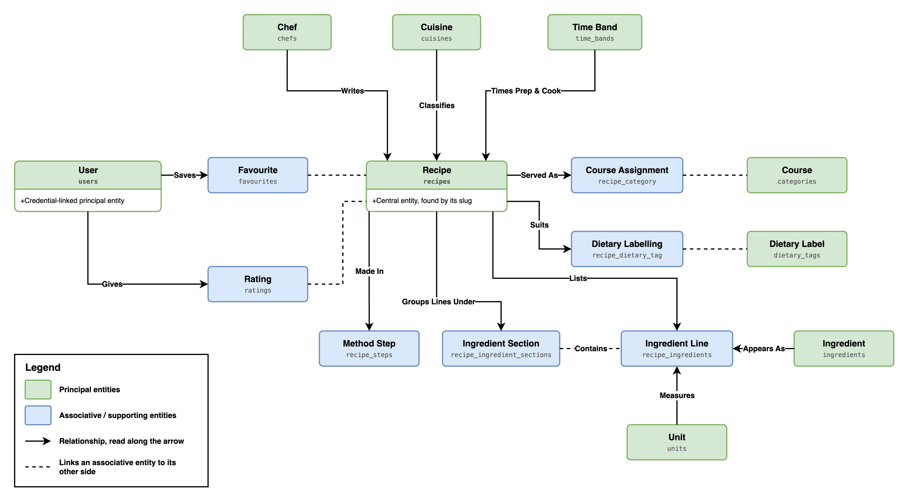
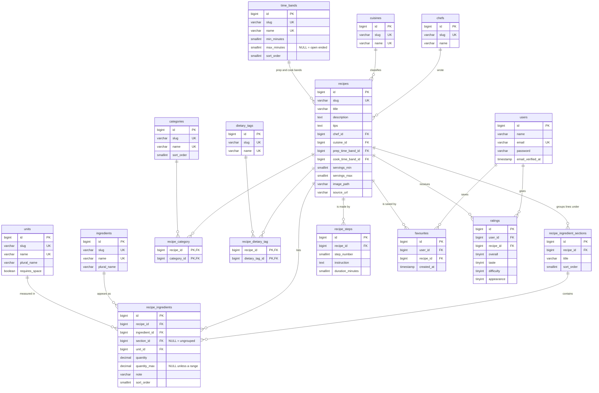

# Database design

Schema for the recipe web app, covering the tables, the ER diagram, and the reasoning
behind the normalisation decisions. The authoritative definition is the set of
migrations in `database/migrations/`; this document explains why they look the way
they do.

**Target:** MySQL 9 (`utf8mb4`, InnoDB). The test suite runs on SQLite in memory, so
the migrations avoid MySQL-only syntax except where noted.

To read the schema as SQL rather than as migrations, or to load it without running
them, [database/sql](../database/sql/README.md) holds a mysqldump of these tables and
of the seeded data.

---

## 1. ER diagram

The overview first: one box per table, with the relationships named. Green boxes are the
principal entities, blue boxes the associative and supporting ones; solid arrows read
along the arrow, and dashed lines join an associative entity to its other side
([more on this figure](architecture-diagrams.md#8-data-model)).



The full diagram below adds every column, key and constraint.



---

## 2. What each table holds

| Table | Holds | Why it is its own table |
| --- | --- | --- |
| `users` | Account name, email, password hash | Supplied by Laravel; owned by the Users & Accounts workstream |
| `chefs` | The person a recipe is credited to | Several recipes share a chef; supports "more by this chef" |
| `cuisines` | Indian, French, North African, … | Repeats across recipes; a recipe has at most one |
| `categories` | Starter, Main course, Dessert, … | A recipe has **one or more**, so it cannot be a column |
| `dietary_tags` | vegan, gluten-free, nut-free, … | Many-to-many, and the vocabulary is shared across recipes |
| `time_bands` | "less than 30 mins" and its numeric bounds | Label and bounds belong to the band, not to each recipe |
| `units` | g, ml, tbsp, clove, pinch, … | Small closed vocabulary reused on every ingredient line |
| `ingredients` | One row per distinct ingredient | The point of the whole exercise: "which recipes use olive oil" |
| `recipes` | Facts true of the recipe as a whole | The central entity |
| `recipe_category` | Recipe ↔ category | Junction for a many-to-many relationship |
| `recipe_dietary_tag` | Recipe ↔ dietary tag | Junction for a many-to-many relationship |
| `recipe_ingredient_sections` | "For the base", "For the topping" | The heading belongs to the recipe, not to each line beneath it |
| `recipe_ingredients` | One line of an ingredient list | Amount, unit and preparation note for a recipe/ingredient pairing |
| `recipe_steps` | One instruction and its duration | An ordered, repeating group; cannot live in `recipes` |
| `favourites` | Recipes a user has saved | Junction with its own creation time |
| `ratings` | One user's scores for one recipe | Junction with its own attributes |

---

## 3. Normalisation

The brief and the group's technical proposal both require at least **3NF**. Each form
is checked below, with the specific decision it drove.

### 1NF — every column holds a single value

No comma-separated lists and no JSON standing in for a relationship.

- A recipe's categories are rows in `recipe_category`, not `"main,vegetarian"` in a
  column.
- An ingredient list is rows in `recipe_ingredients`, not a text blob.
- The method is rows in `recipe_steps`, not a numbered paragraph.
- `servings_text` ("Serves 6-8") is **not** stored. It holds two values in one column;
  the bounds are stored as `servings_min` and `servings_max` and the sentence is
  rebuilt for display by `Recipe::servingsText()`.

### 2NF — every column depends on the whole key

Only the junction tables have composite keys, and neither carries a non-key column:
`recipe_category` and `recipe_dietary_tag` are `(recipe_id, category_id)` and
`(recipe_id, dietary_tag_id)` and nothing else, so there is nothing that could depend
on half the key.

`recipe_ingredients` deliberately does **not** use `(recipe_id, ingredient_id)` as its
key, because a recipe can legitimately list the same ingredient twice — olive oil in
both the base and the topping of the Healthy pizza. It uses a surrogate key with
`sort_order` giving the line its position.

### 3NF — no column depends on another non-key column

This is where most of the design work went.

- **Timings.** Storing `prep_time_text = "less than 30 mins"` on every recipe would
  repeat the same label across rows, and pairing it with a `prep_time_minutes` column
  makes two columns that must be kept consistent by hand. Both are attributes of the
  *band*, not of the recipe, so `time_bands` holds `name`, `min_minutes`,
  `max_minutes` and `sort_order`, and a recipe holds two foreign keys into it.
- **Units.** `"tbsp"`, its plural, and whether it takes a space before the ingredient
  are attributes of the unit. They live in `units`; `recipe_ingredients` references it.
- **Ingredient names.** `"olive oil"` and its plural form are attributes of the
  ingredient, held once in `ingredients`.
- **Section headings.** `"For the topping"` is an attribute of the section. Repeating
  it on each of the eight lines beneath it would be a transitive dependency; the lines
  reference `recipe_ingredient_sections` instead.
- **Aggregates.** A recipe's average rating depends on the `ratings` rows, not on the
  recipe, so it is computed with `AVG()` at query time and no `average_rating` column
  exists. The same applies to a recipe's total time, which is derived from its steps.

### BCNF — every determinant is a key

The lookup tables each have two candidate keys: the surrogate `id` and the natural
name. Both `slug` and `name` carry `UNIQUE` constraints on `cuisines`, `categories`,
`dietary_tags`, `time_bands`, `units` and `ingredients`, so the determinant
`name → (everything else)` is a key and BCNF holds.

`chefs.name` is deliberately **not** unique: two people can share a name, and the slug
disambiguates them. `name` is therefore not a determinant there.

### 4NF — no independent multi-valued facts in one table

A recipe's categories and its dietary tags are independent of each other. Putting both
in one `recipe_tags` table would produce a multi-valued dependency and force a row for
every combination. They are kept as two separate junction tables.

### Deliberate denormalisation

**None.** Every value in the schema is either a stored fact or a foreign key. The one
thing that was considered and rejected is described in section 6.

---

## 4. Nullable columns, and what NULL means

Each nullable column has exactly one meaning, so that `NULL` never has to be
interpreted from context.

| Column | `NULL` means |
| --- | --- |
| `recipes.chef_id` | The source does not credit a chef |
| `recipes.cuisine_id` | The source does not classify the cuisine |
| `recipes.source_url` | The recipe did not come from anywhere else |
| `recipes.tips` | The source published no tips |
| `time_bands.max_minutes` | The band has no upper bound ("over 2 hours") |
| `units.plural_name` | The plural is written the same way ("2 tbsp") |
| `ingredients.plural_name` | The ingredient is measured, not counted, and is never pluralised |
| `recipe_ingredients.section_id` | The line is not under a named heading |
| `recipe_ingredients.unit_id` | The ingredient is counted, not measured ("2 onions") |
| `recipe_ingredients.quantity` | The source states no amount ("icing sugar, for dusting") |
| `recipe_ingredients.quantity_max` | The amount is exact, not a range |
| `ratings.taste` / `difficulty` / `appearance` | The user gave an overall score but skipped that facet |

---

## 5. Constraints and indexes

### Business rules held in the database

| Rule | How |
| --- | --- |
| A user saves a recipe at most once | `UNIQUE (user_id, recipe_id)` on `favourites` |
| A user rates a recipe at most once | `UNIQUE (user_id, recipe_id)` on `ratings` |
| Scores run from 1 to 5 | `CHECK` constraints on `ratings` (MySQL only; see note) |
| Steps are numbered without duplicates | `UNIQUE (recipe_id, step_number)` |
| Ingredient lines have a definite order | `UNIQUE (recipe_id, sort_order)` |
| A recipe has no two identically named sections | `UNIQUE (recipe_id, title)` |
| Deleting a recipe removes its lines and steps | `ON DELETE CASCADE` |
| Deleting a recipe does not delete shared ingredients | `ON DELETE RESTRICT` on `recipe_ingredients.ingredient_id` |
| Deleting a chef leaves their recipes in place | `ON DELETE SET NULL` |

> The `CHECK` constraints on `ratings` are added with `ALTER TABLE`, which SQLite does
> not support. The migration applies them on MySQL only; under the SQLite test
> database the range is enforced by request validation.

### Indexes, and the query each one serves

| Index | Query it serves |
| --- | --- |
| `recipes(title)` | Title keyword search, and the default alphabetical listing |
| `recipes(chef_id)`, `recipes(cuisine_id)` | Filtering by chef or cuisine (created by the foreign keys) |
| `recipe_category(category_id)` | "All recipes in this category" |
| `recipe_dietary_tag(dietary_tag_id)` | "All vegan recipes" |
| `recipe_ingredients(ingredient_id)` | "Which recipes use olive oil" |
| `favourites(user_id, created_at)` | The account page, newest saved first |
| `ratings(recipe_id, overall)` | Average rating per recipe, and sorting by it |

Foreign keys create their own indexes in InnoDB, so the composite primary keys on the
junction tables cover the recipe-to-taxonomy direction, and the extra single-column
indexes cover the reverse.

---

## 6. Decisions worth recording

**A derived `search_text` column was rejected.** The group's technical proposal raised
it as one option for keyword search. It duplicates values that already live in the
normalised tables and has to be regenerated whenever any of them change, which is a
consistency problem in exchange for speed the application does not need at eight
recipes. Search joins the normalised tables directly. If profiling later shows this is
too slow, the right answer is a MySQL `FULLTEXT` index, not a hand-maintained column.

**Imperial measures are not stored.** BBC prints both ("125g/4½oz"). Storing both would
mean two representations of one fact that could disagree. Only the metric amount is
stored; an imperial view could be computed from it.

**Step durations are ours, not BBC's.** The brief requires a time per step. BBC does
not publish one. Where a step states its own time ("simmer for 1-1½ hours") the stated
figure is used; otherwise the value is an estimate for the work described. This is
recorded at the top of `database/seeders/data/recipes.php`.

**Overall rating is given, not averaged.** `ratings.overall` is a score the user
supplies directly, not the mean of `taste`, `difficulty` and `appearance` — averaging
them would be meaningless, since a high difficulty is not a good thing the way a high
taste score is. It is therefore a stored fact, not a derived value.

**Junction keys differ by purpose.** `recipe_category` and `recipe_dietary_tag` carry
no attributes and are only ever attached and detached, so their key is the pair of
foreign keys. `favourites`, `ratings` and `recipe_ingredients` have their own
attributes and lifecycle and are handled as Eloquent models, so they take a surrogate
key with a `UNIQUE` constraint enforcing the same business rule.

---

## 7. Sample data

Eight recipes, transcribed from the BBC Food pages named in the brief — the assignment
requires at least five. The data lives in `database/seeders/data/recipes.php` and loads
via:

```sh
php artisan migrate:fresh --seed
```

This produces 8 recipes, 10 ingredient sections, 114 ingredient lines and 48 steps,
drawing on 81 distinct ingredients, 13 units, 6 categories, 8 dietary tags, 5 cuisines
and 7 chefs. Four fictional user accounts are created alongside them with 7 saved
recipes and 24 ratings, so the account page and rating-based sorting have something to
work with.

Recipe text and photographs are © BBC and are reproduced for the educational purpose of
this assignment only. Every recipe records its `source_url`, and the recipe page shows
an attribution linking back to the original.

The seeders are idempotent: re-running them updates the existing rows rather than
duplicating them.

---

## 8. Handover notes for the other workstreams

- **Search and sorting.** Built, in `app/Services/RecipeSearch.php`. It joins both
  time bands so that `max_minutes` can be filtered and sorted on, and reads the average
  score through `withAvg('ratings', 'overall')`. The sort key never reaches SQL: it is
  matched against `RecipeSearch::SORTS` and a `match` statement picks the ordering, so
  no user value is ever used as a column name or a direction. Keep it that way when
  adding a sort.
- **Favourites.** The table, the `Favourite` model and `User::favouriteRecipes()` are
  in place. No UI is built: the recipe page has no save button yet.
- **Ratings.** Likewise, `ratings` and the `Rating` model exist and are seeded, but
  nothing writes them from the browser yet. Validate `overall` as
  `required|integer|between:1,5` and the three facets as `nullable|integer|between:1,5`
  to match the database constraints.
