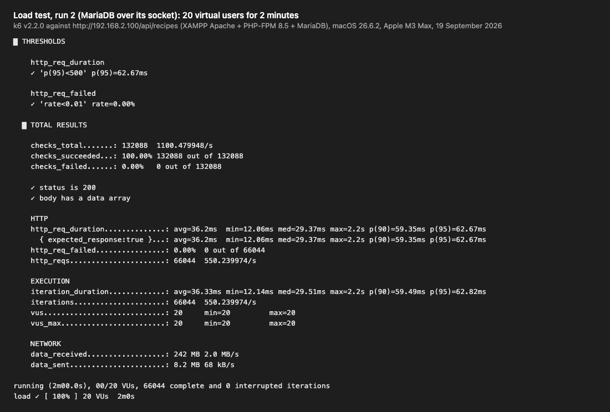
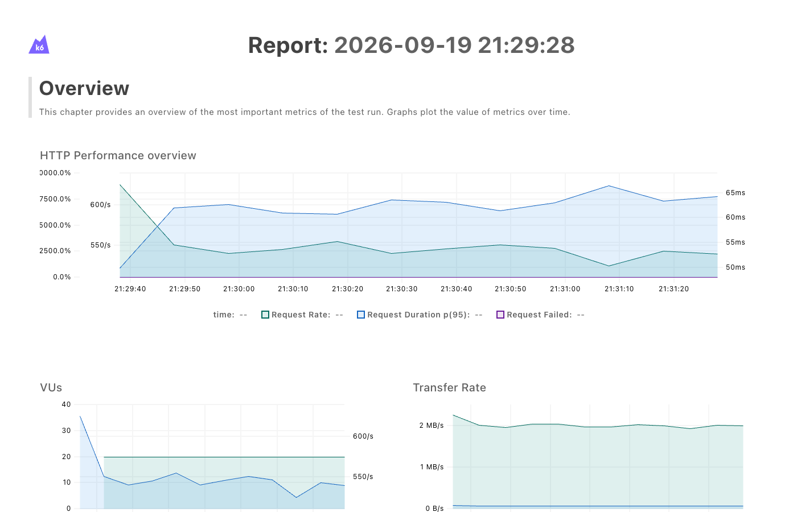
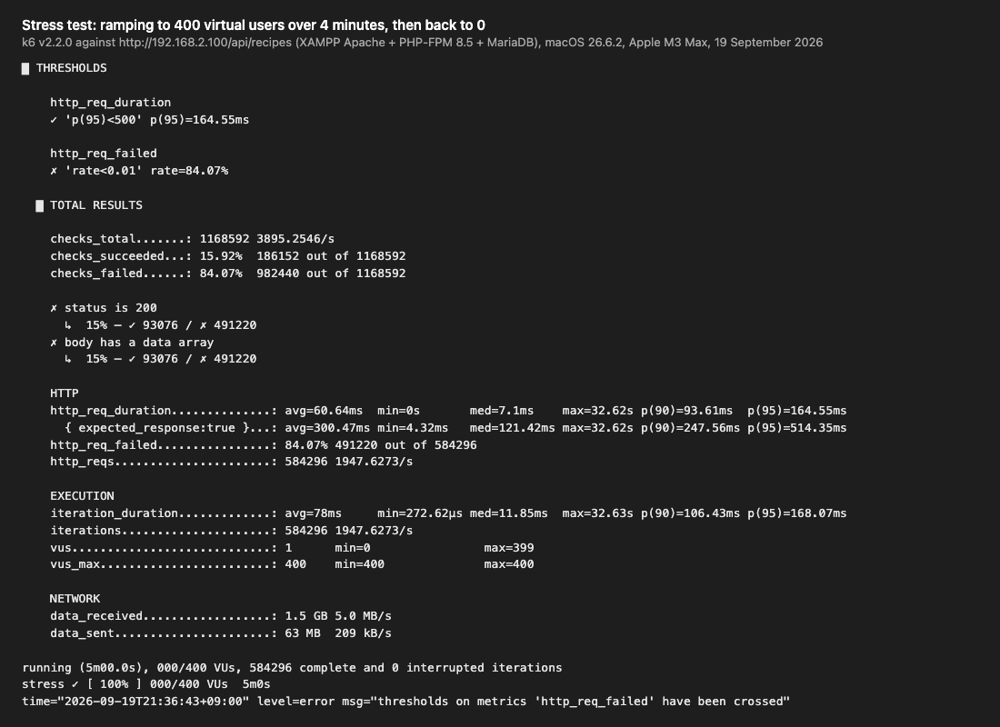
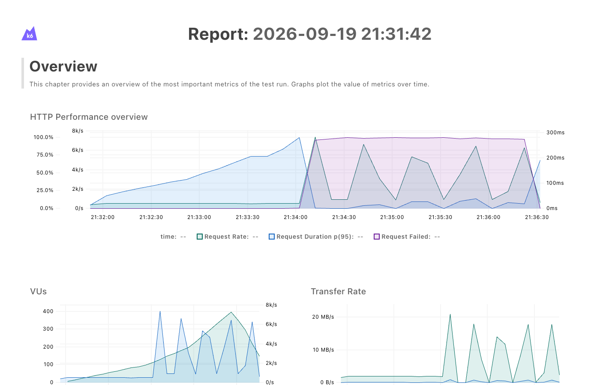
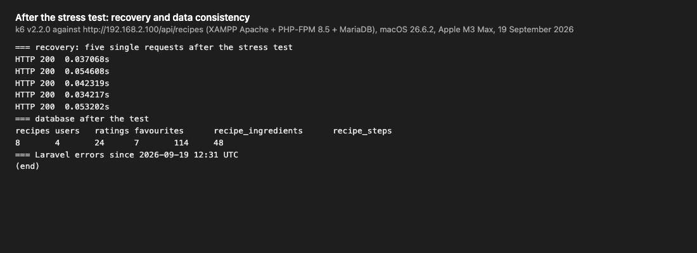
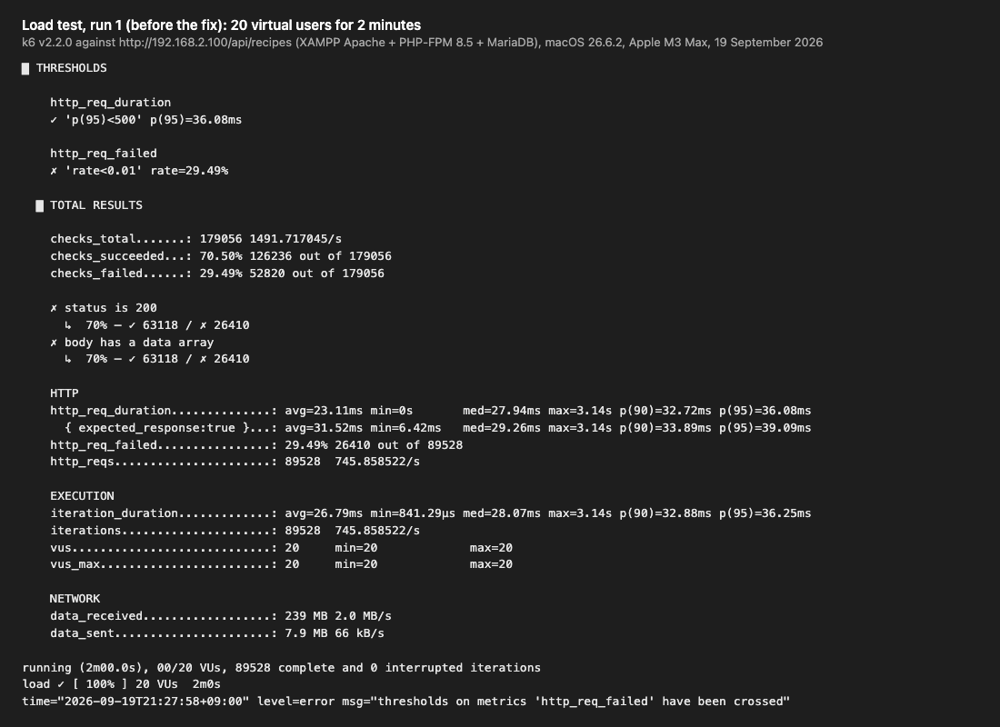
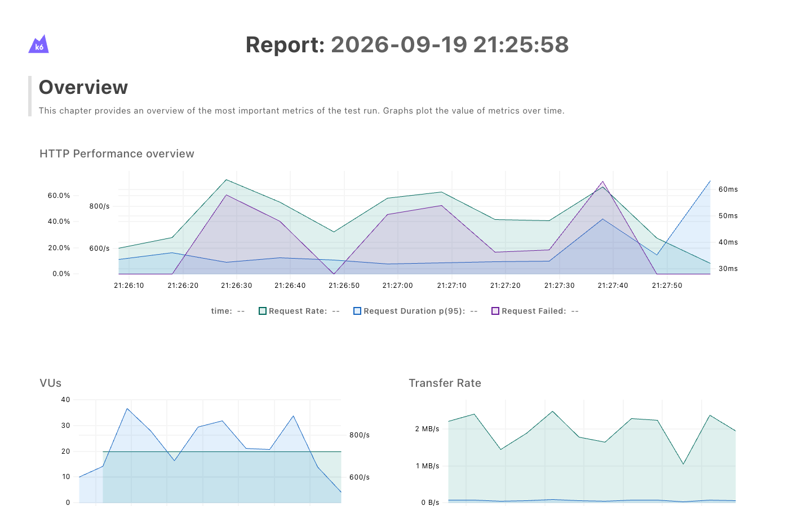

# Load and stress testing the JSON search API

This records the k6 load and stress tests of `GET /api/recipes` (proposal §7.3), with
the numbers and screenshots for the report.

| | |
| --- | --- |
| **Date** | 19 September 2026 |
| **Tool** | k6 v2.2.0, script [`tests/load/recipe-search-api.js`](../tests/load/recipe-search-api.js) |
| **Target** | `http://192.168.2.100/api/recipes` — the XAMPP copy of the site ([xampp.md](xampp.md)), never a shared or public server |
| **Load test** | 20 virtual users for 2 minutes: **550 requests a second, 0 % errors, p95 62.7 ms** (after the fix below) |
| **Stress test** | Ramping to 400 users: **clean up to about 124 concurrent users**, at about 530 requests a second; beyond roughly 150 users most requests are refused with 503 |
| **Recovery** | Full and immediate once the load dropped; no restart, no errors in the application log |
| **Data** | Unchanged: every table count was the same before and after |
| **Found and fixed** | One TCP connection to the database per request exhausted the machine's network ports; the site now talks to MariaDB through its socket file |

## 1. Test set-up

| | |
| --- | --- |
| Machine | macOS 26.6.2, Apple M3 Max. **k6 and the site ran on the same machine**, so they competed for CPU and network ports (see [limitations](#8-limitations)) |
| Web server | XAMPP 8.2.4's Apache 2.4.56, prefork MPM, `MaxRequestWorkers 150`, `KeepAlive On` |
| PHP | PHP-FPM 8.5.10, pool `recipebox`, **`pm.max_children = 5`**, over a Unix socket |
| Database | XAMPP's MariaDB 10.4.28 |
| Application | Laravel 13, `APP_ENV=xampp`; the API's rate limiter keeps its counters in the database cache |
| Rate limit | Normally 60 requests a minute per IP. Raised to 1,000,000 for the test with `API_RECIPE_SEARCH_PER_MINUTE`, or the test would only have measured the limiter; **restored to 60 afterwards** (checked: the 61st request in a minute gets 429) |
| Requests | Each virtual user repeatedly picks one of seven real searches at random, such as `q=pizza`, `sort=quickest` or `min_rating=4&sort=title_desc`, and checks for a 200 response with a `data` array |
| Pass thresholds | Set in the script: error rate under 1 %, and 95 % of requests answered within 500 ms. The group has not yet agreed its own targets (§7.2), so these results are the baseline to set them against |

Before the tests the API answered a single search in 66 ms (33 ms after the fix), and
the database held 8 recipes, 4 users, 24 ratings, 7 favourites, 114 ingredient lines
and 48 steps.

## 2. Load test, run 1: a problem found

| Metric | Result |
| --- | --- |
| Requests | 89,528 in 2 minutes (745.9 a second) |
| Failed | **29.49 %** — threshold failed |
| Response time of successful requests | average 31.5 ms, p95 39.1 ms |

The failures were not slow responses. Grouping every request by result showed two kinds:

| Requests | Result | Meaning |
| --- | --- | --- |
| 63,118 | HTTP 200 | Worked |
| 26,014 | No response, `dial: can't assign requested address` | k6 could not even open a connection |
| 396 | HTTP 500 | Laravel logged `SQLSTATE[HY000] [2002] Can't assign requested address` while connecting to MariaDB on `127.0.0.1:3307` |

**Cause.** Every request opened a new TCP connection from PHP to MariaDB and closed it
at the end. A closed TCP connection keeps its port for about 30 seconds, and every
program on the machine draws from the same 16,384 ports (49152–65535 on macOS). At about
750 requests a second that is over 20,000 ports held at once, so the machine ran out:
first PHP's database connections failed (the 500s), then k6's own connections. k6 was
not the cause: it reused its connections, opening only 963 in the whole run.

**Fix.** The XAMPP site now connects to MariaDB through its Unix socket file
(`DB_SOCKET` in `.env.xampp`), which uses no network ports at all. It is also faster:
a single search went from 66 ms to 33 ms. [xampp.md](xampp.md) now includes this
setting.

## 3. Load test, run 2: after the fix

| Metric | Result |
| --- | --- |
| Requests | 66,044 in 2 minutes: **550.2 a second** |
| Failed | **0.00 %** ✓ |
| Response time | average 36.2 ms, median 29.4 ms, p90 59.4 ms, **p95 62.7 ms** ✓, max 2.2 s |
| Data received | 242 MB |

Both thresholds passed. Run 2 completed fewer requests than run 1 only because run 1's
count included failures that returned instantly; the rate of **successful** requests was
about the same (526 a second in run 1, 550 in run 2).

## 4. Stress test

Users rose from 0 to 50, 100, 200 and 400, a minute each, then fell back to 0 over the
last minute.

| Metric | Result |
| --- | --- |
| Requests | 584,296 in 5 minutes (1,947.6 a second, including fast failures) |
| Successful | 93,076 |
| Failed | 84.07 % (threshold failed, as expected for a stress test) |

What happened, in 15-second windows (response times are for successful requests only):

| From | Users | Requests/s | Errors | Successful/s | Average | p95 |
| --- | --- | --- | --- | --- | --- | --- |
| 0 s | 12 | 463 | 0.0 % | 463 | 12 ms | 25 ms |
| 15 s | 24 | 528 | 0.0 % | 528 | 34 ms | 65 ms |
| 30 s | 37 | 540 | 0.0 % | 540 | 57 ms | 84 ms |
| 45 s | 49 | 539 | 0.0 % | 539 | 80 ms | 104 ms |
| 60 s | 62 | 547 | 0.0 % | 547 | 102 ms | 122 ms |
| 75 s | 74 | 537 | 0.0 % | 537 | 127 ms | 153 ms |
| 90 s | 87 | 516 | 0.0 % | 516 | 156 ms | 195 ms |
| 105 s | 99 | 532 | 0.0 % | 532 | 175 ms | 208 ms |
| **120 s** | **124** | **528** | **0.0 %** | **528** | **212 ms** | **256 ms** |
| 135 s | 149 | 5,105 | 93.2 % | 346 | 354 ms | 732 ms |
| 150 s | 174 | 946 | 98.5 % | 14 | 5,653 ms | 11,649 ms |
| 165 s | 199 | 4,745 | 98.6 % | 64 | 1,352 ms | 1,882 ms |
| 180 s | 249 | 2,346 | 99.3 % | 16 | 5,602 ms | 9,814 ms |
| 195 s | 299 | 3,949 | 99.5 % | 20 | 4,027 ms | 20,113 ms |
| 210 s | 349 | 3,357 | 99.4 % | 19 | 2,717 ms | 4,562 ms |
| 225 s | 399 | 2,700 | 98.4 % | 42 | 8,240 ms | 21,380 ms |
| 240 s | 398 | 4,589 | 99.4 % | 26 | 2,751 ms | 5,681 ms |
| 255 s | 331 | 1,551 | 97.6 % | 37 | 5,954 ms | 15,573 ms |
| 270 s | 203 | 4,387 | 92.2 % | 343 | 451 ms | 2,319 ms |
| 285 s | 95 | 546 | 0.0 % | 546 | 93 ms | 170 ms |

The full timeline is in
[`evidence/load-testing/stress-timeline-15s.json`](evidence/load-testing/stress-timeline-15s.json).

### What the numbers show

- **Throughput ceiling: about 530–550 successful requests a second**, whatever the
  number of users. PHP-FPM runs at most 5 PHP processes at once (`pm.max_children = 5`;
  its log repeatedly warned "server reached pm.max_children setting (5)"), so extra users
  only queue. That is why response time rises steadily with the number of users: 124
  users sharing 528 requests a second wait about 235 ms each, matching the measured
  average of 212 ms.
- **Highest stable concurrency: about 124 users.** That is the last window with no
  errors and p95 within 500 ms. By 149 users it had broken down.
- **How it fails: fast refusals, not crashes.** Of the failures, 410,090 were **503
  Service Unavailable**: Apache logged `Connection refused … php-fpm-recipebox.sock` for
  every one. PHP-FPM's queue of waiting connections was full, and macOS caps such a
  queue at 128 (`kern.ipc.somaxconn`), so beyond about 5 running plus 128 waiting,
  new requests are refused at once. Another 81,130 failed on the client side, while k6
  was opening connections (k6 error codes 1213, 1211 and 1050). Apache's own limit of
  150 workers is reached at the same point.
- **No application errors.** Laravel's log recorded no errors during the stress test,
  so every failure was capacity, not a bug.
- **Recovery.** As the load fell to 95 users, errors went back to 0 % and p95 to
  170 ms. Straight after the test, five single requests took 34–55 ms, and the site
  needed no restart.
- **Data consistency.** The endpoint only reads, and every table count after the test
  matched the count before it.

## 5. Recommendations

For a production server, in order of effect:

1. **More PHP-FPM processes.** `pm.max_children = 5` sets the ceiling. Raising it towards
   the number of CPU cores (memory permitting) raises throughput roughly in proportion.
2. **A longer connection queue.** Set `listen.backlog` in the pool and raise the
   operating system's limit (`kern.ipc.somaxconn` on macOS, `net.core.somaxconn` on
   Linux), so bursts wait instead of being refused.
3. **Apache's event MPM with PHP-FPM**, instead of prefork's 150 workers, so idle
   keep-alive connections do not hold a worker each.
4. **A memory cache (Redis) for the rate limiter**, instead of the database cache, which
   adds a database query to every API request.
5. **Keep database connections off TCP where the database is local** (done, section 2),
   or reuse them, so one connection per request cannot exhaust ports.
6. **Run k6 from a separate machine** for final numbers, so the tool does not share CPU
   and ports with the server.

## 6. Evidence


**Figure D.1** — k6's summary for the load test after the fix: 66,044 requests, 0 %
errors, p95 62.7 ms, both thresholds passed.


**Figure D.2** — k6's HTML report for the same run: a steady request rate and flat
response time throughout.


**Figure D.3** — k6's summary for the stress test.


**Figure D.4** — k6's HTML report for the stress test: the request rate climbs steadily
until about 21:34 (roughly 150 users), when the failure rate jumps to nearly 100 %, and
it drops back to 0 as the load falls away at the end.


**Figure D.5** — Straight after the stress test: single requests answered in 34–55 ms,
the database counts unchanged, and no errors in Laravel's log.


**Figure D.6** — Run 1, before the fix: 29.49 % failures.


**Figure D.7** — Run 1's HTML report.

The complete k6 reports are also kept as images
([run 1](images/load-testing/k6-load-run1-before-fix.png),
[run 2](images/load-testing/k6-load-run2.png),
[stress](images/load-testing/k6-stress.png)) and as interactive HTML files that open in
any browser: [run 1](evidence/load-testing/load-run1-before-fix-report.html),
[run 2](evidence/load-testing/load-run2-report.html),
[stress](evidence/load-testing/stress-report.html).

## 7. Problems during testing and how we solved them

| # | Problem | Cause | Solution |
| --- | --- | --- | --- |
| L1 | Without changes, nearly every request would get 429 Too Many Requests | The API allows 60 requests a minute per IP, and every k6 request comes from one IP | Raise `API_RECIPE_SEARCH_PER_MINUTE` in `.env.xampp` for the test only, then remove it (done, and checked) |
| L2 | 29 % of requests failed at only 20 users (run 1) | One database TCP connection per request exhausted the machine's ports | Connect to MariaDB through its socket file (section 2) |
| L3 | k6 cannot reach `recipebox.localhost` reliably | That name is resolved specially by browsers and curl, not by every program | Target the Mac's own address, `192.168.2.100`, which the virtual host also answers |
| L4 | The raw results were too large to keep: 83–813 MB of per-request data, and terminal logs of 20–64 MB | k6 records every request, and its live progress display fills the log | Keep k6's summaries, the HTML reports and a 15-second timeline computed from the raw data; leave the raw files out of the repository |

## 8. Limitations

- **Client and server on one machine.** k6 used CPU and network ports that the server
  would otherwise have had, so real capacity is somewhat higher than measured.
- **A development configuration.** XAMPP's settings, and PHP-FPM's 5 processes, are not
  tuned for production; section 5 lists what to change.
- **One run of each test.** Repeated runs would show how much the numbers vary.
- **One endpoint.** Only the read-only JSON search was tested, as the proposal specifies.
  Logging in was deliberately not load-tested, because it is rate limited on purpose.

## 9. How to repeat

On a local copy only, with the XAMPP site running:

```sh
# In .env.xampp, for the duration of the test only:
#   API_RECIPE_SEARCH_PER_MINUTE=1000000

K6_WEB_DASHBOARD=true K6_WEB_DASHBOARD_EXPORT=load-report.html \
  k6 run -e TEST_TYPE=load -e BASE_URL=http://192.168.2.100 \
  --summary-export load-summary.json tests/load/recipe-search-api.js

K6_WEB_DASHBOARD=true K6_WEB_DASHBOARD_EXPORT=stress-report.html \
  k6 run -e TEST_TYPE=stress -e BASE_URL=http://192.168.2.100 \
  --summary-export stress-summary.json tests/load/recipe-search-api.js

# Then remove API_RECIPE_SEARCH_PER_MINUTE from .env.xampp again.
```

Add `--out csv=samples.csv` to keep every request for analysis like section 4's table.
