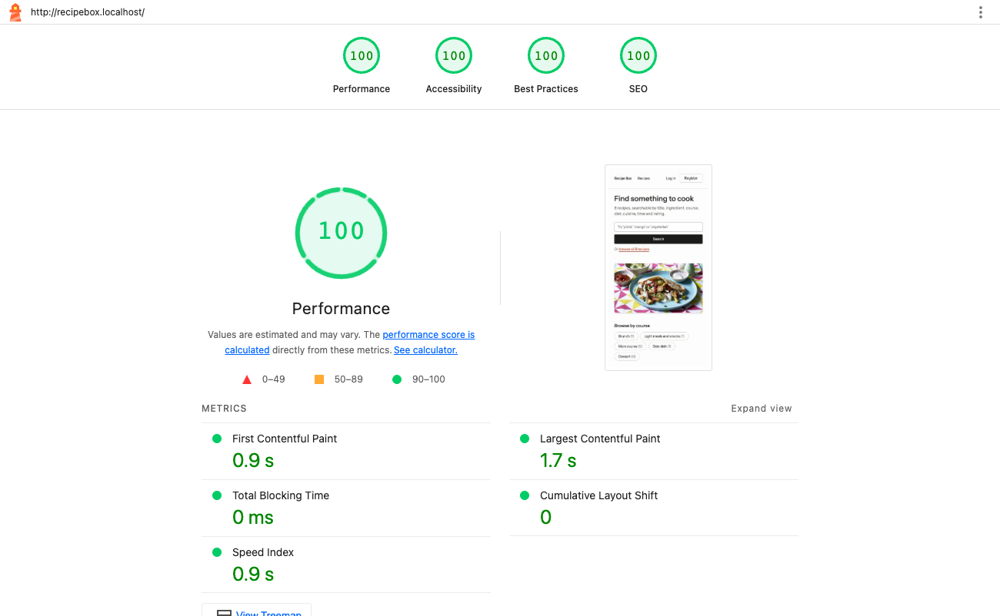
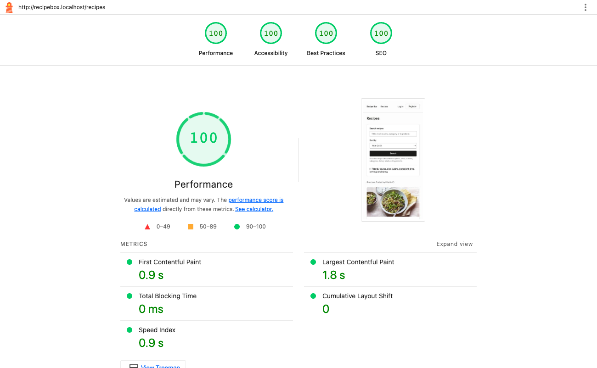
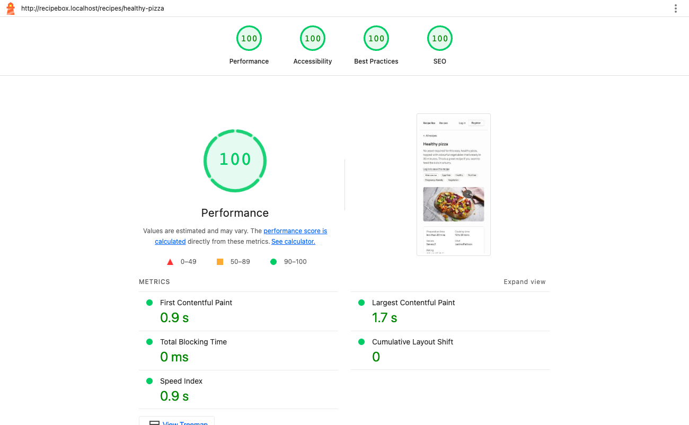
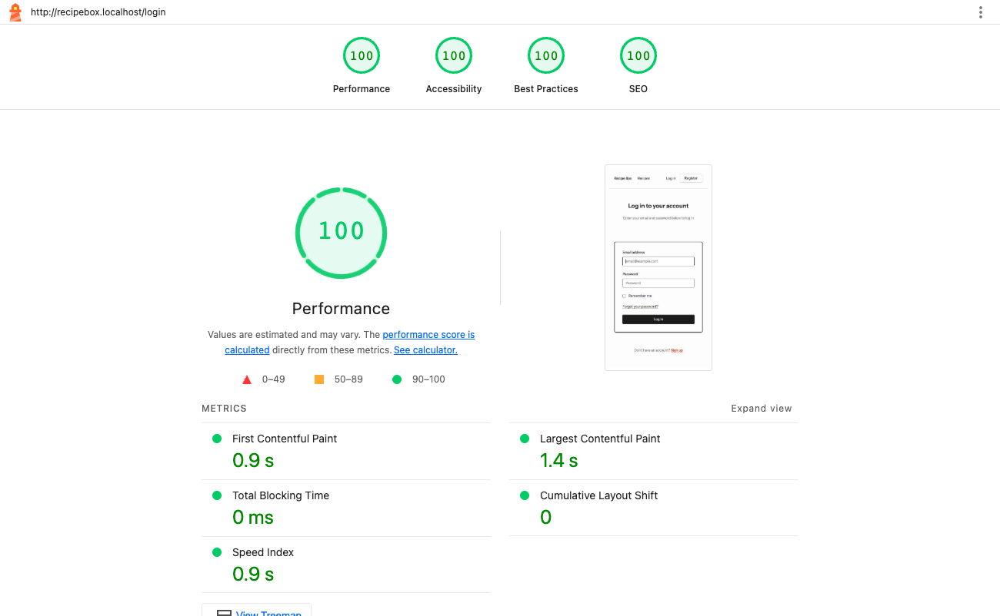
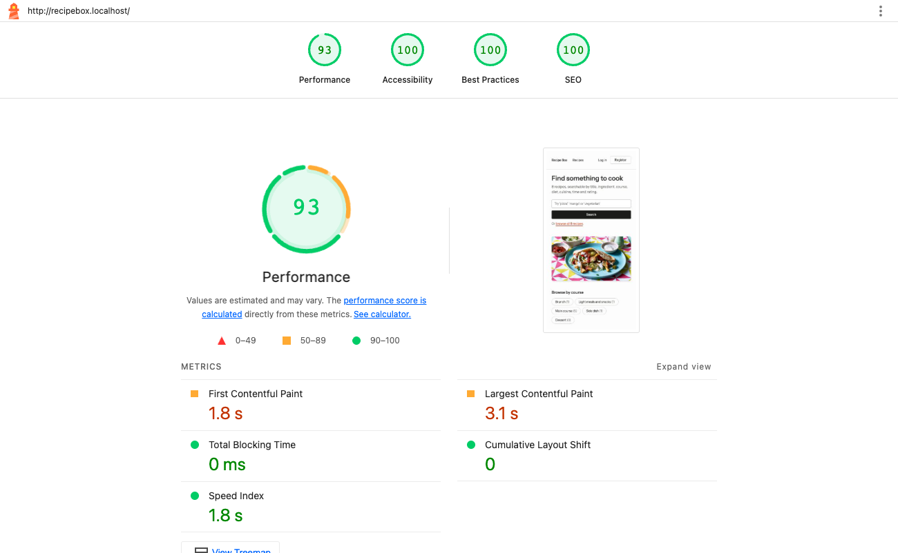
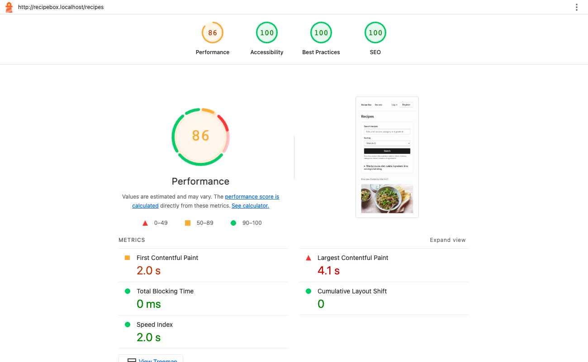
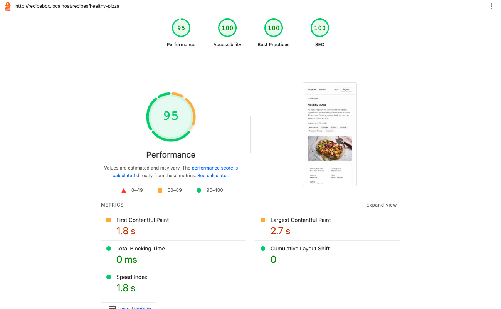
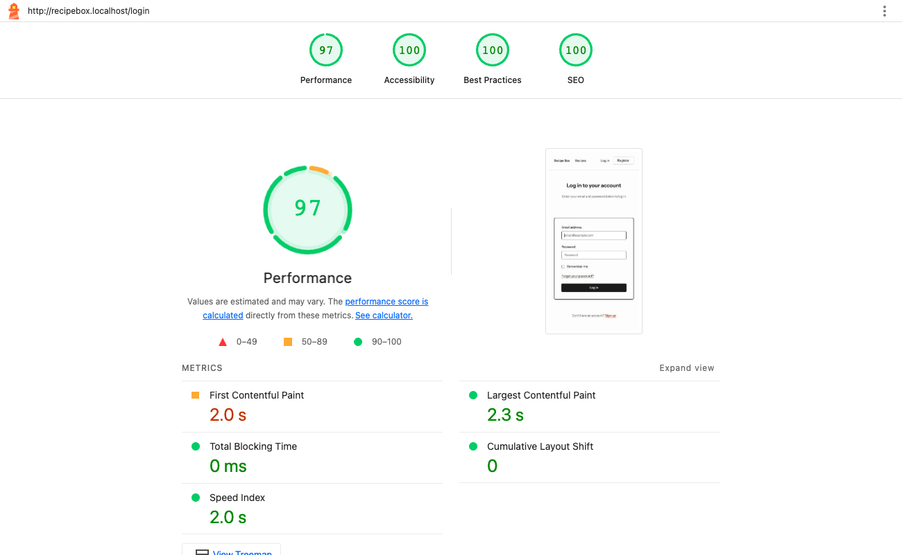

# Performance acceptance criteria

The proposal (§7.2) asks the group to agree measurable performance targets — "the
permitted response time, error rate and page-performance score" — and to test against
them. This page proposes those targets, and checks the application against each one.

| | |
| --- | --- |
| **Status** | **Proposed** on 19 September 2026, for the group to agree or adjust (sign-off at the end) |
| **Measured on** | The XAMPP copy of the site ([xampp.md](xampp.md)), on macOS 26.6.2, Apple M3 Max |
| **Result** | **All 18 criteria met.** The first measurement missed 4 of them, all caused by how the site was delivered — compression, fonts and images. [Section 3](#3-what-was-fixed) describes the three fixes, and the numbers before and after |

## 1. The criteria

Each criterion is measurable and has a single number. Where a well-known standard
exists, the threshold follows it; otherwise it is set from what the application needs,
with headroom.

### Page experience

Measured with Lighthouse 13.4 in **mobile** mode, which simulates a mid-range phone on a
slow 4G connection, on four pages: home, recipe listing, a recipe, and login.

| # | Criterion | Threshold | Why this threshold |
| --- | --- | --- | --- |
| PC1 | Lighthouse Performance score | **≥ 90** on every page | Lighthouse's own "good" band is 90–100 |
| PC2 | Largest Contentful Paint (when the main content appears) | **≤ 2.5 s** | Google's Core Web Vitals "good" threshold |
| PC3 | Cumulative Layout Shift (how much the page jumps while loading) | **≤ 0.1** | Core Web Vitals "good" threshold |
| PC4 | Total Blocking Time (how long scripts block input) | **≤ 200 ms** | Lighthouse's "good" threshold; the lab stand-in for Core Web Vitals' Interaction to Next Paint (≤ 200 ms) |
| PC5 | Lighthouse Accessibility score | **≥ 95** | Accessibility is a requirement of the brief; 95 leaves room for one minor warning |

### Page weight

What a first visit downloads, from the same Lighthouse runs (sizes as transferred).

| # | Criterion | Threshold | Why this threshold |
| --- | --- | --- | --- |
| PC6 | Total per page | **≤ 1,000 KiB** | Keeps a first visit cheap on a mobile data plan; about half of a typical mobile page |
| PC7 | JavaScript per page | **≤ 50 KiB** | The site deliberately uses no front-end framework |
| PC8 | CSS per page | **≤ 30 KiB** | Twice the size of the compressed stylesheet, so it holds only if the server compresses text |
| PC9 | Web fonts per page | **≤ 60 KiB** | Three weights of one typeface, in one format |
| PC10 | Any single image | **≤ 200 KiB** | Recipe photos are shown at most 832 px wide |

### Server

Measured on the XAMPP stack: single requests with curl (20 each, asking for compressed
responses as a browser does), and k6 for load ([load-testing.md](load-testing.md)).

| # | Criterion | Threshold | Why this threshold |
| --- | --- | --- | --- |
| PC11 | Server response time of every page (time to first byte), 95th percentile | **≤ 200 ms** | Leaves the rest of Google's 800 ms "good" server response budget for the network |
| PC12 | A search (`/recipes?q=…&sort=…`), 95th percentile | **≤ 200 ms** | Searching is the site's main task, and 200 ms still feels immediate |
| PC13 | JSON API at the expected load of 20 simultaneous users, 95th percentile | **≤ 500 ms** | The k6 script's own threshold |
| PC14 | Error rate at the expected load | **< 1 %** | The k6 script's own threshold |
| PC15 | Capacity: simultaneous users served with < 1 % errors and p95 ≤ 500 ms | **≥ 50** | Well above a class-sized demonstration |
| PC16 | Recovery after overload | Normal response times **within 60 s**, **without a restart** | The proposal asks whether the application recovers |

### Database

| # | Criterion | Threshold | Why this threshold |
| --- | --- | --- | --- |
| PC17 | Queries per page | Within each page's budget in `tests/Feature/QueryBudgetTest.php` | Budgets are the measured counts plus two; a page that starts running more fails CI |
| PC18 | N+1 queries | **None** | `Model::preventLazyLoading()` turns any N+1 query into an error in every test and page load outside production |

## 2. Results

Measured on 19 September 2026, after the fixes in section 3. Every criterion is met.

| # | Home | Listing | Recipe | Login | Result |
| --- | --- | --- | --- | --- | --- |
| PC1 Performance score ≥ 90 | 100 | 100 | 100 | 100 | ✓ |
| PC2 Largest Contentful Paint ≤ 2.5 s | 1.7 s | 1.8 s | 1.7 s | 1.4 s | ✓ |
| PC3 Layout shift ≤ 0.1 | 0 | 0 | 0 | 0 | ✓ |
| PC4 Blocking time ≤ 200 ms | 0 ms | 0 ms | 0 ms | 0 ms | ✓ |
| PC5 Accessibility ≥ 95 | 100 | 100 | 100 | 100 | ✓ |
| PC6 Total ≤ 1,000 KiB | 155 | 266 | 108 | 76 | ✓ |
| PC7 JavaScript ≤ 50 KiB | 5 | 5 | 5 | 5 | ✓ (2 KiB since a later fix, see below) |
| PC8 CSS ≤ 30 KiB | 14 | 14 | 14 | 14 | ✓ |
| PC9 Fonts ≤ 60 KiB | 51 | 51 | 51 | 51 | ✓ |
| PC10 Any image ≤ 200 KiB | 33 | 33 | 30 | no images | ✓ |

| # | Measured | Result |
| --- | --- | --- |
| PC11 Pages, p95 time to first byte ≤ 200 ms | home 46 ms, listing 38 ms, recipe 51 ms, login 20 ms | ✓ |
| PC12 Search, p95 ≤ 200 ms | 49 ms | ✓ |
| PC13 API at 20 users, p95 ≤ 500 ms | 62.7 ms | ✓ |
| PC14 Error rate at 20 users < 1 % | 0.00 % (66,044 requests) | ✓ |
| PC15 Capacity ≥ 50 users | about 124 users | ✓ |
| PC16 Recovery within 60 s, no restart | errors back to 0 % while the load was still falling; 34–55 ms straight afterwards | ✓ |
| PC17 Query budgets | every page within budget, checked by the test suite and CI | ✓ |
| PC18 No N+1 queries | none, checked on every test run | ✓ |

PC13–PC16 come from the k6 run in [load-testing.md](load-testing.md), which the fixes
did not affect: they change what browsers download, not how the API answers.

Lighthouse's mobile simulation is deliberately pessimistic: it slows the network to a
poor 4G connection and the processor fourfold. On the local network the pages appear
far faster, but the criteria are measured this way so that the numbers can be repeated
and compared.

## 3. What was fixed

The first measurement, earlier the same day, met 14 of the 18 criteria:

| # | Home | Listing | Recipe | Login |
| --- | --- | --- | --- | --- |
| PC1 Performance score ≥ 90 | 93 | **86** | 95 | 97 |
| PC2 Largest Contentful Paint ≤ 2.5 s | **3.1 s** | **4.1 s** | **2.7 s** | 2.3 s |
| PC6 Total ≤ 1,000 KiB | 453 | 799 | 289 | 205 |
| PC8 CSS ≤ 30 KiB | **66** | **66** | **66** | **66** |
| PC9 Fonts ≤ 60 KiB | **94** | **94** | **94** | **115** |
| PC10 Any image ≤ 200 KiB | 91 | 99 | 94 | no images |

None of the four misses was in the application's logic. They had three causes, each
fixed once for the whole site:

| Fix | What was wrong | What changed | Effect |
| --- | --- | --- | --- |
| **Compress text** | Apache's compression module was loaded but not told what to compress, so the stylesheet was sent at its full 66 KiB. | `public/.htaccess` now compresses HTML, CSS, JavaScript, JSON and SVG. It lives in the project, so it works on any Apache that runs the site — XAMPP on every system, or production — without editing the server's configuration. | CSS 66 → 14 KiB; each page's HTML 15–58 KiB → 4–8 KiB |
| **Load each font once** | Every page downloaded each font weight twice, as WOFF2 and as WOFF, because the font plugin's `fontsource` provider writes a separate `@font-face` rule for each format. | `vite.config.js` uses the plugin's `local` provider instead, pointing at only the three WOFF2 files in the same `@fontsource/instrument-sans` package. Every current browser reads WOFF2. | Fonts 94–115 → 51 KiB |
| **Smaller, modern images** | Every screen got the full-size 832 px JPEG, up to 99 KiB, and a recipe photo is the largest element on the home, listing and recipe pages. | Each photo has WebP copies 416, 640 and 832 px wide beside the JPEG. The `x-recipe-image` component prints them as a `srcset`, with a `sizes` hint, so the browser downloads the smallest copy that fits. The recipe page's and the home page's main photo also load with high priority, as the first card on the listing already did. The JPEGs stay, because the JSON API's `image_url` returns them. | Largest image 99 → 33 KiB; Largest Contentful Paint 2.7–4.1 s → 1.7–1.8 s |

Server response times stayed far inside their limit: the 95th percentiles moved by 2–15
ms, about as much as they vary between two runs anyway ([before](evidence/performance/server-response-times-before.txt),
[after](evidence/performance/server-response-times.txt)).

The JavaScript was still sent uncompressed in these runs: XAMPP labels `.js` files with
the old type `application/x-javascript`, which the compression rule did not list at the
time. Adding it later cut the file from 4.8 to 1.7 KiB
([sustainability.md](sustainability.md#3-what-was-changed)).

Browsers now also keep the built files for a year and the photos for a week, so a
repeat visit downloads only the page itself
([sustainability.md](sustainability.md#3-what-was-changed)). That does not change these
first-visit measurements.

### Adding a recipe photo

A new photo needs its three WebP copies next to it, or pages show a broken image. From
`public/images/recipes`, with `cwebp` installed (`brew install webp`, or `apt install
webp`):

```sh
for width in 416 640 832; do
    cwebp -q 75 -resize $width 0 new-recipe.jpg -o new-recipe-$width.webp
done
```

`tests/Feature/RecipePageTest.php` fails if any seeded recipe's photo is missing a copy.

## 4. How each criterion is checked

| Criteria | How | When |
| --- | --- | --- |
| PC17, PC18 | Automatically, by the test suite (`composer test`) | Every push, in CI |
| PC13–PC16 | k6, as described in [load-testing.md](load-testing.md) | Before submission, and after changes to the server set-up |
| PC1–PC12 | Lighthouse (mobile) on the four pages, and curl timings, on the XAMPP site | Before submission, and after changes to pages, images, fonts or styles |

## 5. Evidence

After the fixes:

| | |
| --- | --- |
|  **E.1** Home |  **E.2** Recipe listing |
|  **E.3** Recipe page |  **E.4** Login |

Before the fixes:

| | |
| --- | --- |
|  **E.5** Home |  **E.6** Recipe listing |
|  **E.7** Recipe page |  **E.8** Login |

The complete Lighthouse reports open in any browser. After:
[home](evidence/performance/lighthouse-home.html),
[listing](evidence/performance/lighthouse-recipes.html),
[recipe](evidence/performance/lighthouse-recipes-healthy-pizza.html),
[login](evidence/performance/lighthouse-login.html). Before:
[home](evidence/performance/lighthouse-home-before.html),
[listing](evidence/performance/lighthouse-recipes-before.html),
[recipe](evidence/performance/lighthouse-recipes-healthy-pizza-before.html),
[login](evidence/performance/lighthouse-login-before.html). The server timings are in
[`evidence/performance/`](evidence/performance), and the load-test evidence in
[load-testing.md](load-testing.md#6-evidence).

## 6. Sign-off

The group agrees these criteria as the project's performance targets, with any changes
noted here.

| Name | Agreed | Changes requested | Date |
| --- | --- | --- | --- |
| | | | |
| | | | |
| | | | |
| | | | |
