# Responsive layout testing: phones and tablets

This records how Recipe Box looks and behaves on phone and tablet screens, with the
evidence for the report. It follows the desktop Chrome device-emulation check recorded
in [status.md](status.md#quality-attributes).

| | |
| --- | --- |
| **Date** | 19 September 2026 |
| **Site tested** | Recipe Box on XAMPP ([xampp.md](xampp.md)), opened over Wi-Fi at `http://192.168.2.100`, the way a phone reaches it |
| **Android phone** | Pixel 9 emulator: Android 16, Chrome 145, 1080×2424 px at 420 dpi, which Chrome lays out at **411 CSS px** wide |
| **Android tablet** | Tablet emulator: Android 16, Chrome 128, 1600×2560 px at 320 dpi, laid out at **800 CSS px** (portrait) and **1280 CSS px** (landscape) |
| **Result** | 27 page loads (9 pages × 3 screens): **no horizontal scrolling on any page**, and every screenshot shows the layout adapting to the screen. |
| **Still open** | The check on real iPhone, iPad, Android phone and Android tablet ([section 5](#5-real-devices-by-a-person)). |

## 1. Method

- **Real mobile Chrome.** Each page was opened in Chrome inside the Android emulator,
  over the network at the Mac's Wi-Fi address, exactly as a phone on the same Wi-Fi
  would open it.
- **Measured inside the device's own browser.** Through Chrome's remote debugging (the
  channel behind `chrome://inspect`), the script compared each page's full width with
  the screen width, and listed any element sticking out past the edge.
- **Screenshots of the whole device screen**, taken with Android's own `adb screencap`,
  so Chrome's address bar and the Android status bar are in every picture.
- **Nine pages**, as a guest and signed in as the sample account: the home page, search
  results, a recipe, login, registration with its errors showing, the privacy notice,
  the account page, account settings, and the rating form.

The script is kept in [`evidence/responsive/scripts/`](evidence/responsive/scripts) and
the raw measurements in [`evidence/responsive/`](evidence/responsive).

## 2. Results

Width is the page's layout width in CSS pixels; overflow is how far the page is wider
than the screen (0 means no sideways scrolling).

| Page | Pixel 9 (411 px) | Tablet portrait (800 px) | Tablet landscape (1280 px) |
| --- | --- | --- | --- |
| Home | 0 px overflow | 0 px | 0 px |
| Search results (`/recipes?q=a`) | 0 px | 0 px | 0 px |
| Recipe page | 0 px | 0 px | 0 px |
| Login | 0 px | 0 px | 0 px |
| Registration, with errors | 0 px | 0 px | 0 px |
| Privacy notice | 0 px | 0 px | 0 px |
| Account page (signed in) | 0 px | 0 px | 0 px |
| Account settings (signed in) | 0 px | 0 px | 0 px |
| Rating form (signed in) | 0 px | 0 px | 0 px |

## 3. Screenshots

All 27 screenshots are in [`images/responsive/`](images/responsive), named
`<device>-<page>.png`. A selection:

| | |
| --- | --- |
| 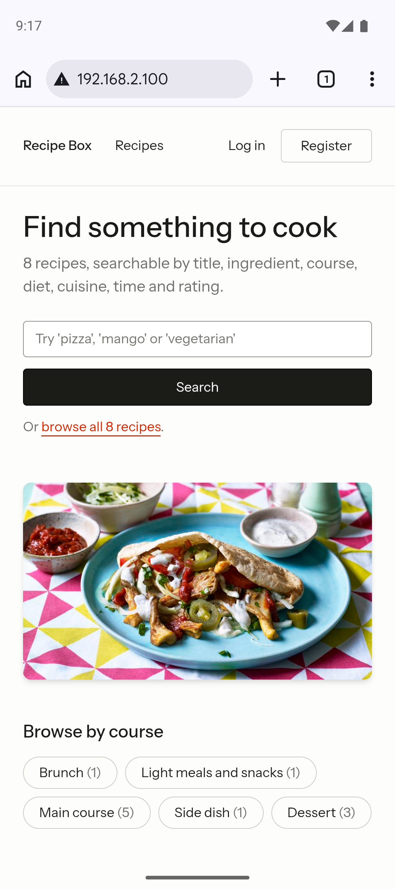 **C.1** Pixel 9, home: the search box and button stack to fit the width | 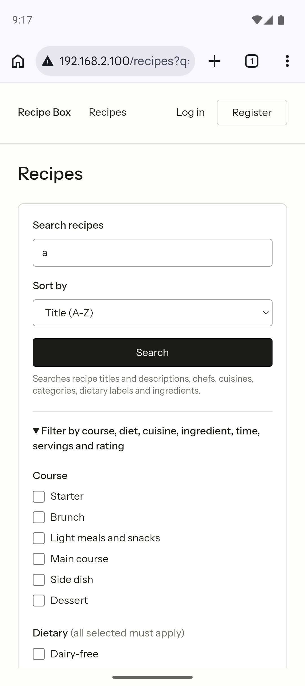 **C.2** Pixel 9, search results |
| 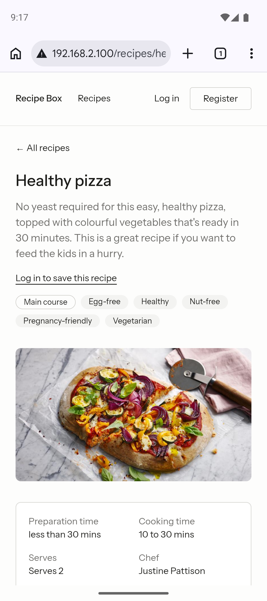 **C.3** Pixel 9, recipe page | 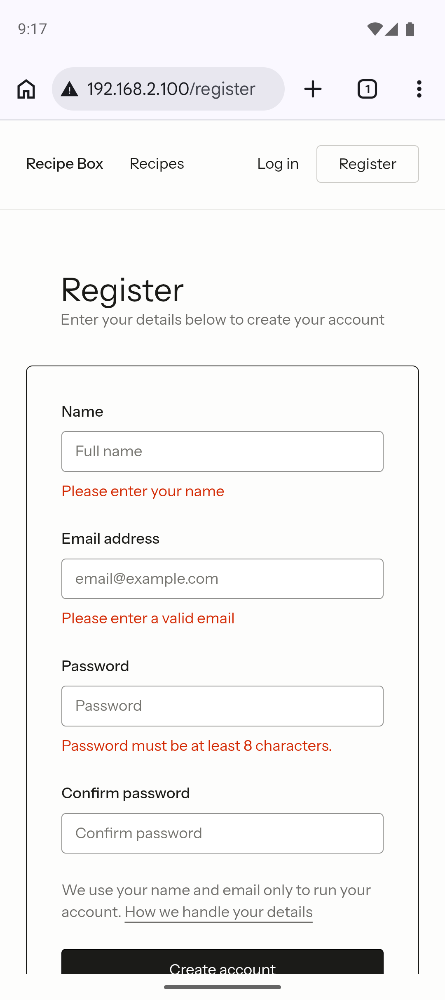 **C.4** Pixel 9, registration errors under each field |
| 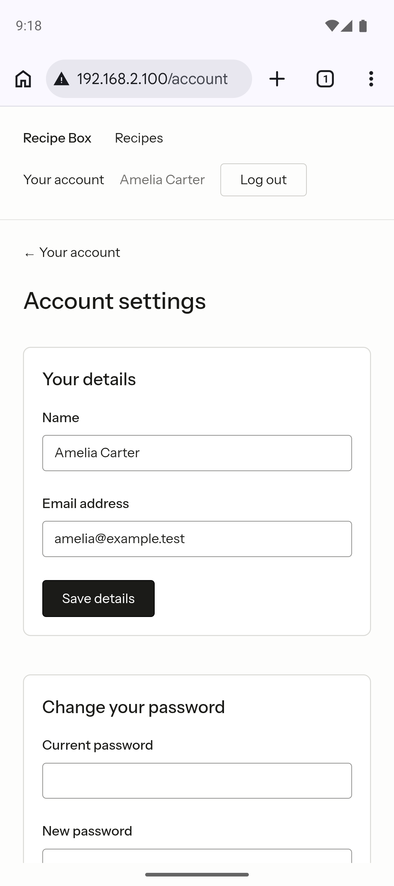 **C.5** Pixel 9, account settings; the signed-in header wraps to two rows | 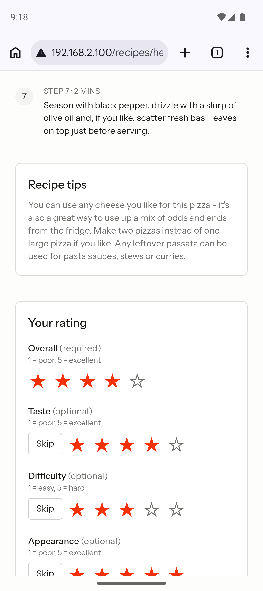 **C.6** Pixel 9, rating stars spaced apart for tapping |

| | |
| --- | --- |
| 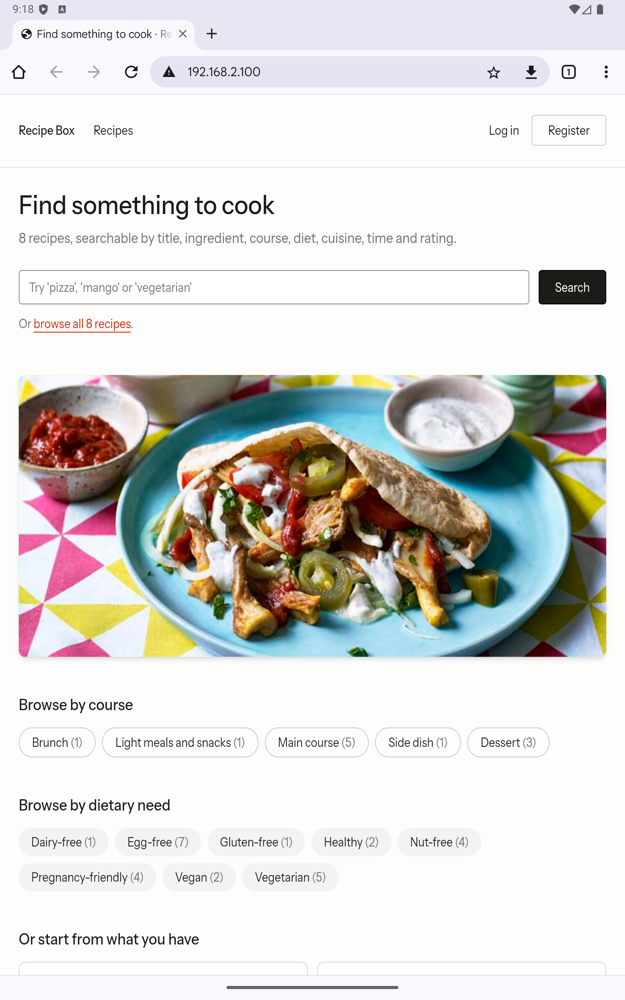 **C.7** Tablet portrait, home: the search button sits beside the box | 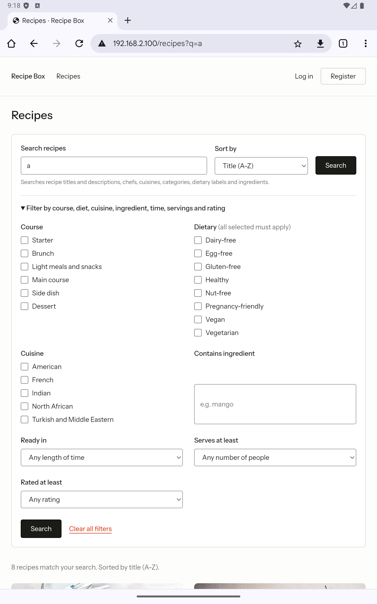 **C.8** Tablet portrait, search results |
| 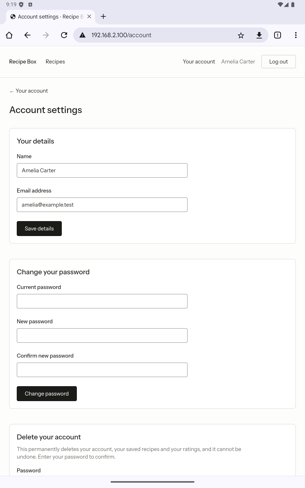 **C.9** Tablet portrait, account settings: fields keep a readable width | 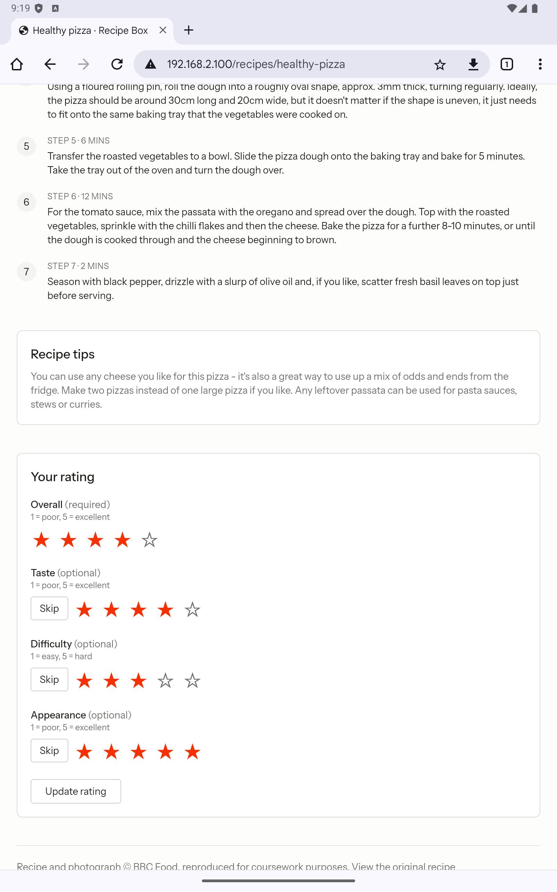 **C.10** Tablet portrait, rating form |

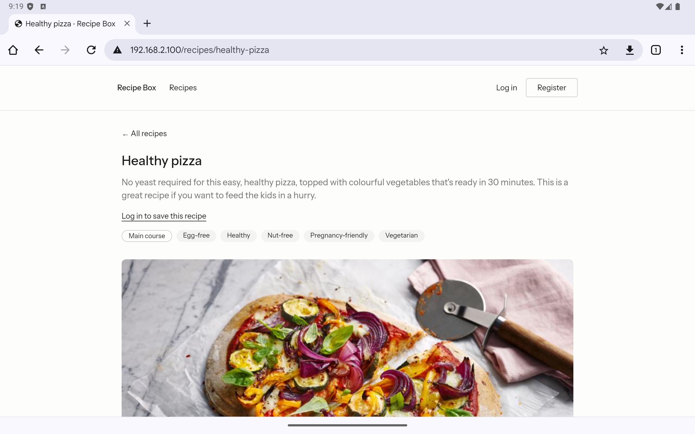
**C.11** Tablet landscape, recipe page: the content keeps a comfortable reading width.

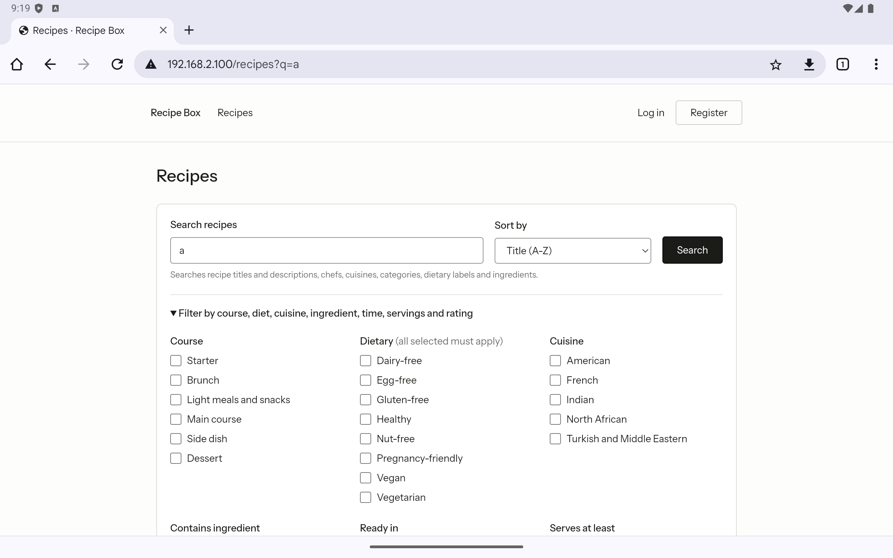
**C.12** Tablet landscape, search results.

## 4. Observations

| # | Observation | Action |
| --- | --- | --- |
| R1 | On a phone, the signed-in header wraps onto two rows: the site links, then "Your account", the name and "Log out" (C.5). Everything fits and stays tappable. | None needed; a menu button would save one row if wanted |
| R2 | On a tablet, form fields keep a readable maximum width rather than stretching across the screen (C.9). | Intended |
| R3 | Chrome marks the address "Not secure", because the Wi-Fi test serves plain HTTP. | Test set-up only; production uses HTTPS ([deployment.md](deployment.md)) |
| R4 | No page scrolls sideways on any screen, and no element sticks out past the edge. | — |

## 5. Real devices (by a person)

To complete: open `http://192.168.2.100` on each device, on the same Wi-Fi as the Mac
running XAMPP, and take these screenshots:

| # | What to capture |
| --- | --- |
| D1 | Home page, top |
| D2 | Home page, scrolled to the recipe cards |
| D3 | Search "pizza", the results |
| D4 | A recipe page, top |
| D5 | The same recipe, scrolled to Ingredients and Method |
| D6 | After logging in as `amelia@example.test` / `password`, the "Your account" page |
| D7 | A recipe page signed in, after tapping a star in "Overall" |
| D8 | Tablets only: the home page and a recipe page in landscape |

| Device | Model, OS and browser | Sideways scrolling? | Text readable without zooming? | Buttons and stars easy to tap? | Notes | Screenshots |
| --- | --- | --- | --- | --- | --- | --- |
| iPhone | | | | | | |
| iPad | | | | | | |
| Android phone | | | | | | |
| Android tablet | | | | | | |

The screenshots go in [`images/responsive/real-devices/`](images/responsive/real-devices).

## 6. Problems during testing and how we solved them

| # | Problem | Cause | Solution |
| --- | --- | --- | --- |
| P1 | A phone cannot open `http://recipebox.localhost` | `.localhost` names only reach the machine they are typed on | A temporary `ServerAlias 192.168.2.100` in the virtual host, so devices on the Wi-Fi reach the site by the Mac's address. **Remove it after testing**: while it is there, anyone on the network can open the site |
| P2 | No iPhone or iPad simulator | The iOS Simulator needs the full Xcode, and only Xcode's command-line tools were installed | Android emulators for the automated evidence; the iPhone and iPad are checked by hand (section 5) |
| P3 | No tablet emulator, and the tool that creates one (`avdmanager`) was not installed | Only a Pixel 9 emulator existed | A tablet emulator made from a copy of the Pixel 9's settings with a tablet screen, reusing the Android 16 image already on the machine |
| P4 | Chrome's first-run screens, and on the tablet a Google sign-in screen, covered the site | A new emulator's Chrome asks to sign in | "Use without an account", and Back out of the Google sign-in; no account was added |
| P5 | Could not connect to the emulator's Chrome on port 9222 | Another program on the Mac already used 9222 | Forward Chrome's debugging socket to port 9333 instead |
| P6 | Android overlays covered some screenshots: a "Try out your stylus" tutorial, and Password Manager warning that the sample password ("password") appears in data breaches | The keyboard opens when the site moves focus to the first invalid field; the warning is Google's reaction to a well-known password | The script dismisses these overlays before each screenshot, and takes focus off the field so the keyboard closes. The measurements are unaffected, because they are taken inside the page |
| P7 | The tablet screenshots failed with a flood of raw image bytes | A 1600×2560 screenshot is several megabytes, over Node's default 1 MB output limit | Raise the limit for `adb` to 64 MB |
| P8 | The rating-form screenshot showed the top of the page | The script scrolled to the form, then back to the top | Scroll to the top first, then to the form |

## 7. Limitations

- **Emulators, not physical hardware.** They run the real Android and Chrome code, but
  not a real screen's size in the hand, touch accuracy or real network speed; section 5
  covers that.
- **No Safari (WebKit).** iPhone and iPad use Safari, which only the real-device check in
  section 5 covers.
- **The tablet is a generic 10-inch profile**, not a specific product.

## 8. Evidence files

| Path | Contents |
| --- | --- |
| [`images/responsive/`](images/responsive) | 27 emulator screenshots (C.1–C.12 are a selection) |
| [`images/responsive/real-devices/`](images/responsive/real-devices) | Screenshots from real devices (section 5) |
| [`evidence/responsive/`](evidence/responsive) | Per-page measurements: layout width, overflow, pixel ratio, browser |
| [`evidence/responsive/scripts/`](evidence/responsive/scripts) | The script that took the measurements and screenshots |
