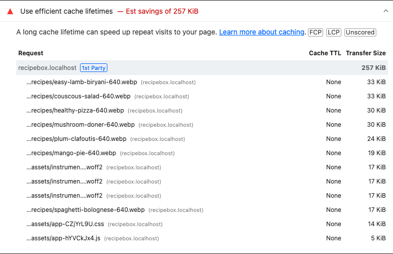
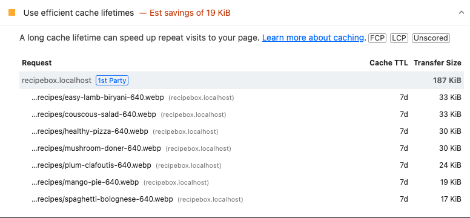
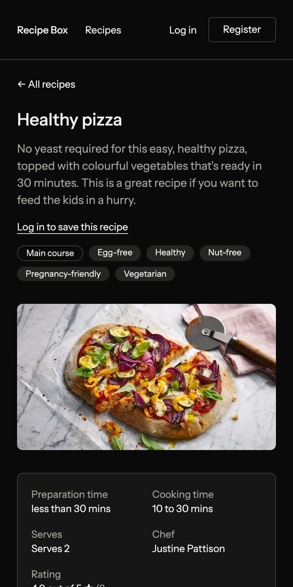

# Web sustainability

Every page view uses electricity: in the data centre that serves it, the networks that
carry it and the device that shows it. The less a page transfers and the less work it
causes, the less energy it uses. This page sets measurable sustainability targets for
the site, checks the site against them, and records what was changed to meet them.

| | |
| --- | --- |
| **Status** | **Proposed** on 19 September 2026, for the group to agree or adjust (sign-off at the end) |
| **Based on** | The W3C [Web Sustainability Guidelines](https://www.w3.org/TR/web-sustainability-guidelines/) (WSG, Group Note Draft of 20 August 2026), and the Sustainable Web Design model for carbon estimates |
| **Measured on** | The XAMPP copy of the site ([xampp.md](xampp.md)), on macOS 26.6.2, in Google Chrome emulating a mid-range phone |
| **Result** | **All 12 criteria met.** Two were missed at first: static files had no cache lifetime, and XAMPP sent the JavaScript uncompressed. [Section 3](#3-what-was-changed) describes the fixes |

## 1. The criteria

Each criterion follows a guideline of the WSG and has a threshold that can be checked.

| # | Criterion | Threshold | WSG guideline |
| --- | --- | --- | --- |
| WS1 | Carbon per page view, as a visitor's phone loads it | **≤ 0.040 g CO2e** — rating **A+** — on every page | The Sustainable Web Design model's rating |
| WS2 | Browser caching | Every built file (CSS, JavaScript, fonts) and image has an explicit cache lifetime; **on a repeat visit, only the page itself is requested from the server** | 4.2 Optimize caching and support offline access |
| WS3 | Text compression | All HTML, CSS, JavaScript and JSON sent compressed | 4.3 Reduce data transfer with compression |
| WS4 | Minified code, no unused code | Lighthouse's minification and unused CSS/JavaScript checks pass | 3.2 Minify and remove unused code |
| WS5 | Images | Modern format, sized for the screen: Lighthouse's image delivery check passes | 2.9 Optimize media to reduce resource use |
| WS6 | Lazy loading | Photos further down the page are **not downloaded until the visitor scrolls towards them**; the photo at the top loads straight away | 3.7 Defer the loading of non-critical resources |
| WS7 | Fonts | One typeface, self-hosted, WOFF2 only, **≤ 60 KiB** per page | 2.11 Use optimized web typography |
| WS8 | Third parties | **No requests** to other sites: no trackers, analytics, advertising, font services or CDNs | 3.5 Treat third parties the same as first parties |
| WS9 | Animation and media | No autoplaying video, carousel or looping animation | 2.10 Ensure animation is proportionate and easy to control |
| WS10 | Device preferences | Dark colours when the device asks for dark mode (less power on OLED screens) | 3.9 Use media queries that support sustainability goals |
| WS11 | Dependencies | No front-end framework; **≤ 50 KiB** of JavaScript per page; dependency audit on every push | 3.12 Use dependencies sparingly and maintain them |
| WS12 | Database work | Every page within its query budget, no N+1 queries, results paginated | 3.16 Reduce the number and complexity of database queries |

**How carbon is estimated (WS1).** [CO2.js](https://developers.thegreenwebfoundation.org/co2js/overview/)
0.19 from the Green Web Foundation, with the Sustainable Web Design model v4 and the
global average carbon intensity of electricity. The model turns the bytes transferred
into energy used by data centres, networks and devices, including the carbon of making
them. Its ratings are those used by the Website Carbon Calculator: A+ is 0.040 g or less
per view, the cleanest 5 % of web pages; then
A ≤ 0.079 g, B ≤ 0.145 g, C ≤ 0.209 g, D ≤ 0.278 g, E ≤ 0.359 g, F above. It is an
estimate, useful for comparing pages and changes rather than as an exact figure.

**How the bytes are measured.** Online calculators need a public address, which a XAMPP
site does not have, so a script drives Google Chrome at the same phone size Lighthouse
uses (412 × 823, 1.75× pixels) and records every file that crosses the network. Each
page is measured three ways: as loaded, after scrolling to the end, and on a repeat
visit. Apache's access log is checked alongside, as an independent record of which
requests reached the server.

## 2. Results

Measured on 19 September 2026. ✓ met.

| Page | First view | CO2e per view | Rating | After scrolling to the end | Repeat visit |
| --- | --- | --- | --- | --- | --- |
| Home | 119 KiB | 0.018 g | A+ | 152 KiB (0.023 g, A+) | 7 KiB, 1 request to the server |
| Recipe listing | 193 KiB | 0.029 g | A+ | 278 KiB (0.042 g, A) | 9 KiB, 1 request |
| Recipe page | 106 KiB | 0.016 g | A+ | 106 KiB | 8 KiB, 1 request |
| Login | 73 KiB | 0.011 g | A+ | 73 KiB | 6 KiB, 1 request |

A first visit that goes from home to the listing, a recipe and the login page transfers
258 KiB in total — **0.039 g CO2e for all four pages** — because the stylesheet, fonts and
script are downloaded once and then reused.

| # | Measured | Result |
| --- | --- | --- |
| WS1 Carbon ≤ 0.040 g per view | 0.011–0.029 g as loaded (table above) | ✓ |
| WS2 Browser caching | Built files cached for a year, photos for a week; on a repeat visit Apache logs one request, the page ([F.1](#6-evidence), [F.2](#6-evidence)) | ✓ after the fix |
| WS3 Compression | Every text response is gzip-compressed: the stylesheet 66 → 14 KiB, the JavaScript 4.8 → 1.7 KiB, each page's HTML 15–58 → 4–8 KiB | ✓ after the fix |
| WS4 Minified, no unused code | Lighthouse's four checks pass on all four pages; Vite minifies the CSS and JavaScript, and Tailwind builds only the classes the templates use | ✓ |
| WS5 Images | WebP in three widths with `srcset`; Lighthouse's image delivery check passes on all four pages. Largest photo sent: 33 KiB (the JPEGs were up to 99 KiB) | ✓ |
| WS6 Lazy loading | The listing downloads 4 of its 8 photos before scrolling and the rest only on the way down, saving about 85 KiB for a visitor who does not scroll; the home page holds back 1 of 3. The first photo is never lazy, so it appears quickly | ✓ |
| WS7 Fonts | Instrument Sans, three weights, WOFF2 only, served by the site: 51 KiB | ✓ |
| WS8 Third parties | Every request goes to the site itself (Lighthouse's third-party check passes); the Content Security Policy blocks anything else | ✓ |
| WS9 Animation and media | No video, carousel or looping animation; the only motion is a card's outline darkening on hover | ✓ |
| WS10 Device preferences | The whole site switches to dark colours with the device's dark mode ([F.3](#6-evidence), [F.4](#6-evidence)) | ✓ |
| WS11 Dependencies | No front-end framework; 2 KiB of JavaScript; `composer audit` and `pnpm audit` run on every push | ✓ |
| WS12 Database work | Query budgets and the N+1 guard pass ([performance.md](performance.md), PC17–PC18); searches return 12 results a page, in the browser and in the API | ✓ |

**Two figures that are higher.** Scrolling to the end of the listing downloads all eight
photos, 278 KiB (0.042 g, rating A). Lighthouse also reports 267 KiB for the listing,
because in its test Chrome fetches 7 of the 8 photos without scrolling. A phone-sized
Chrome window fetches 4, on a fast connection and on a slow 4G one alike, so WS1 uses
what a real browser downloads. Both figures are still rated A.

Other WSG guidelines are covered elsewhere: layouts that work on every device (3.10) in
[responsive.md](responsive.md), and accessibility in [accessibility.md](accessibility.md).

## 3. What was changed

**Before this work, 10 of the 12 criteria were met.** Most were already met because of the
performance fixes made the same day ([performance.md](performance.md#3-what-was-fixed)):
compression, fonts in one format, and WebP photos in several widths. Those fixes also
cut the carbon of every page:

| Page | Before the performance fixes (Lighthouse weight) | After |
| --- | --- | --- |
| Home | 453 KiB — 0.069 g, **A** | 155 KiB — 0.024 g, **A+** |
| Recipe listing | 799 KiB — 0.121 g, **B** | 267 KiB — 0.040 g, **A** (193 KiB, A+, in a real browser) |
| Recipe page | 289 KiB — 0.044 g, **A** | 109 KiB — 0.017 g, **A+** |
| Login | 205 KiB — 0.031 g, **A+** | 76 KiB — 0.012 g, **A+** |

Two criteria were still missed. The first was **WS2, caching**. Apache sent the CSS, JavaScript,
fonts and photos without a `Cache-Control` header. Browsers then guess how long to keep a
file, usually for a tenth of the time since it last changed. Right after a deploy that is
minutes, so returning visitors ask the server about every file again. Lighthouse
estimated 70–257 KiB per page could be saved by caching them.

The fix is in `public/.htaccess`, beside the compression setting, so it works on any
Apache that runs the site:

| Files | Cache lifetime | Why |
| --- | --- | --- |
| `build/assets/*` (CSS, JavaScript, fonts) | 1 year, `immutable` | Each file name contains a hash of its content, so a changed file gets a new name and the old copy is never used again |
| `images/*` (recipe photos) | 1 week | A replaced photo keeps its name, so browsers must check again. After a week they send a short check and download the photo only if it changed |
| Pages | Not cached (`no-cache, private`, set by Laravel) | Pages differ per user and carry the security token for forms |

Lighthouse's cache check now passes for every built file; on three pages it still lists
the photos (3–19 KiB), because it would like them kept for a year. We keep a week
deliberately: a year would leave returning visitors looking at an old photo after it
was replaced.

The second, **WS3, compression**, came to light while measuring: the JavaScript file
arrived uncompressed. XAMPP labels `.js` files with the old type
`application/x-javascript`, which the compression rule did not list. Adding it cut the
file from 4.8 to 1.7 KiB on every page. The "After" column above is Lighthouse's, from
before this fix; the results in section 2 include it.

## 4. Recommended for production, not done here

These cut energy use further on a real server, but either do not apply to a XAMPP site
running on one computer or need that server's configuration.

| Recommendation | WSG | Why it helps | Why not here |
| --- | --- | --- | --- |
| **A content delivery network (CDN)** | 4.10 | A CDN keeps copies of the static files — CSS, JavaScript, fonts, photos — on servers close to each visitor. Data travels a shorter distance over fewer networks, and the application server does less work. The site is ready for one: its built files already have hashed names and a year's cache lifetime | This is a coursework assignment assessed on XAMPP on one computer, where every visitor is on the same machine or network, so there is no distance to shorten. A CDN is also a third party (WS8): the Content Security Policy would have to allow it, and it would see every visitor's requests. For a public site with visitors across several countries, the WSG guideline is to use one "when beneficial" |
| **Green hosting** | 4.1 | A host that runs on renewable electricity and publishes its environmental figures. The Green Web Foundation lists verified hosts | The assignment runs on the group's own computers |
| **Brotli compression** | 4.3 | Compresses text further than gzip, typically by another 15–20 % | XAMPP's Apache does not include the Brotli module; enable `mod_brotli` (or nginx's `brotli`) on a production server |
| **HTTP/2** | 4.3 | Sends all of a page's files over one connection | Needs HTTPS, which the local XAMPP site does not use; see [deployment.md](deployment.md) |

## 5. How to check again

```sh
# Headers: a built file should say max-age=31536000, immutable; a photo max-age=604800.
curl -sI http://recipebox.localhost/images/recipes/healthy-pizza-640.webp | grep -i cache-control
```

Run Lighthouse (as in [performance.md](performance.md)) for WS3–WS5 and WS8, and check
the "Use efficient cache lifetimes" insight for WS2. For WS1 and WS6, open Chrome's
DevTools, choose a phone in the device toolbar, and read the transferred size on the
Network tab before and after scrolling; CO2.js turns the size into grams. On a public
copy of the site, the [Website Carbon Calculator](https://www.websitecarbon.com/) does
both from the address alone. Check again after adding pages, photos, fonts or scripts.

## 6. Evidence

| | |
| --- | --- |
|  **F.1** Before: Lighthouse on the listing, no cache lifetime on any file |  **F.2** After: built files cached for a year; only the photos (a week) are listed |
|  **F.3** Home page in dark mode on a phone |  **F.4** Recipe page in dark mode |

[`evidence/sustainability/measurements.txt`](evidence/sustainability/measurements.txt)
lists every file each page transferred — as loaded, after scrolling and on a repeat
visit — with the CO2e of each view, and the lines Apache logged during each repeat
visit. The full Lighthouse report of the listing with caching is
[`evidence/sustainability/lighthouse-recipes-with-caching.html`](evidence/sustainability/lighthouse-recipes-with-caching.html);
the reports of all four pages, before caching, are with the
[performance evidence](performance.md#5-evidence).

## 7. Sign-off

The group agrees these criteria as the project's sustainability targets, with any
changes noted here.

| Name | Agreed | Changes requested | Date |
| --- | --- | --- | --- |
| | | | |
| | | | |
| | | | |
| | | | |
