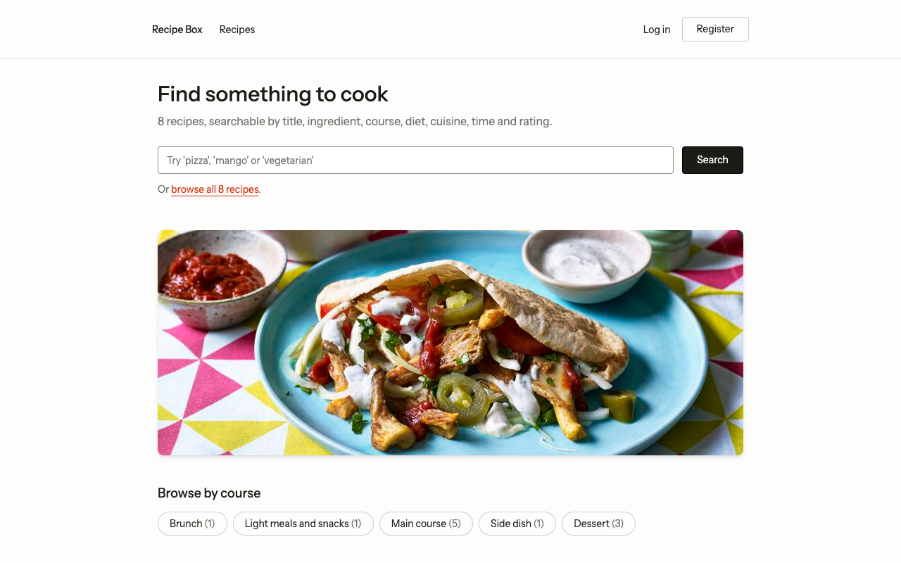
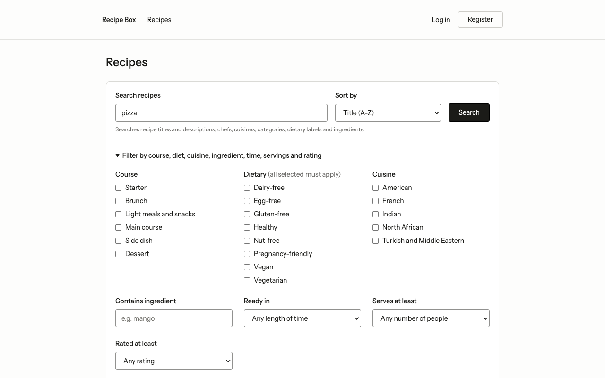
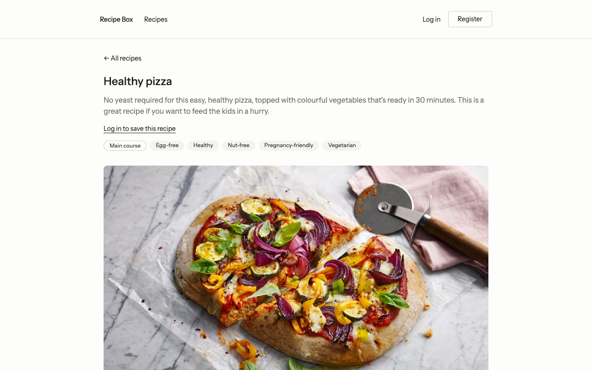
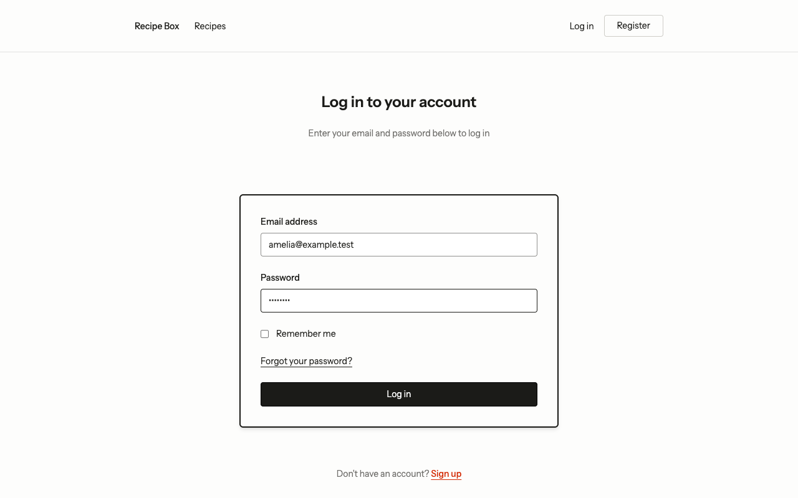
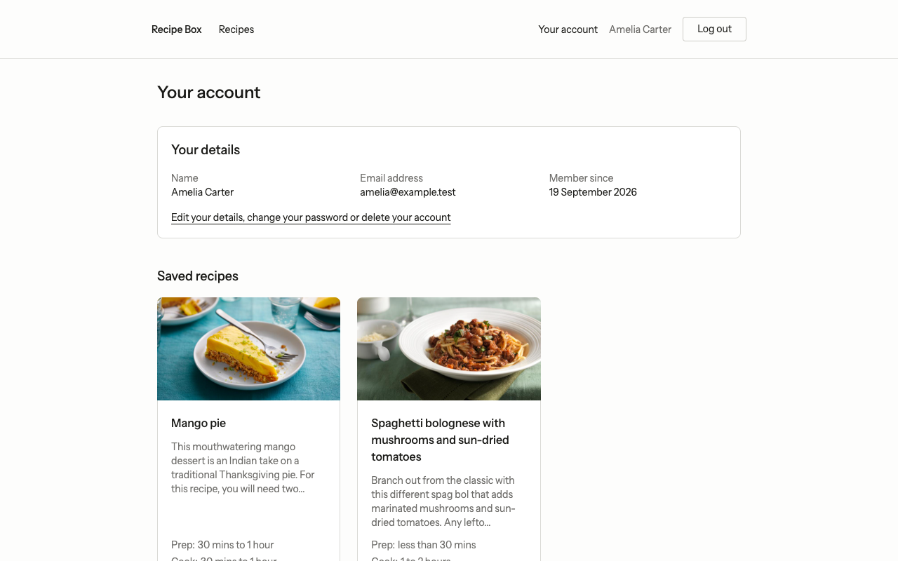
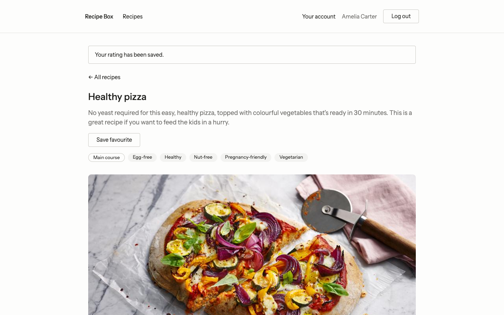
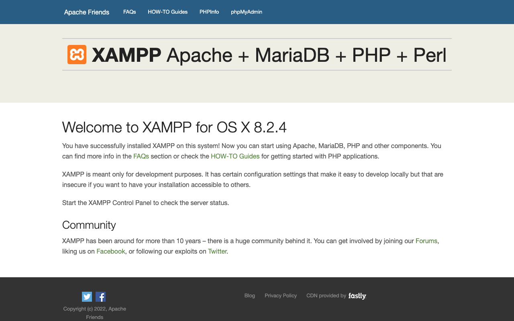
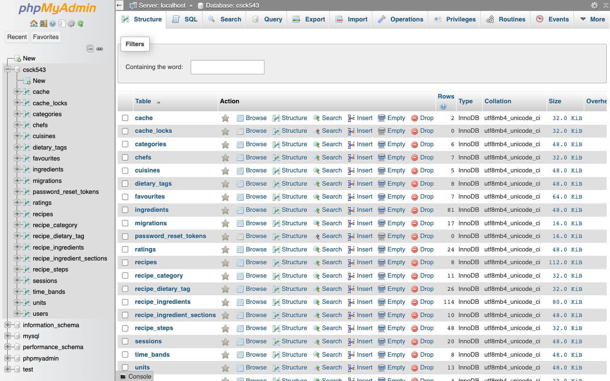
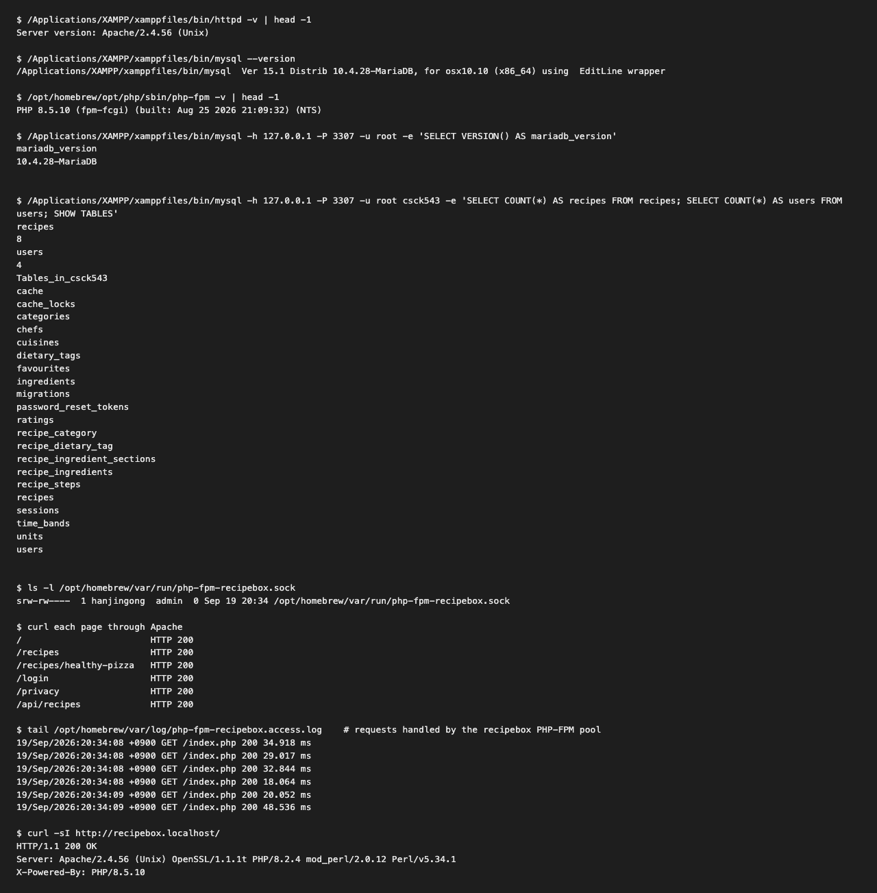

# Running Recipe Box on XAMPP

This guide sets Recipe Box up on Apache and MariaDB from XAMPP, the stack the brief
assesses the application on. It records exactly what we did, the problems we hit and how
we solved them, and the evidence that it works.

| | |
| --- | --- |
| **Tested on** | macOS 26.6.2 on an Apple M3 Max (arm64), 19 September 2026 |
| **Result** | Working. Every page, sign-in, saving a rating and the JSON API run through XAMPP's Apache and MariaDB — see [Evidence](#7-evidence). |
| **XAMPP** | 8.2.4 for macOS: Apache 2.4.56, MariaDB 10.4.28, PHP 8.2.4 |
| **PHP used by the site** | 8.5.10 (Homebrew), as PHP-FPM |
| **Browser** | Google Chrome 153 |
| **Linux and Windows** | Written from the same design, **not yet tested** ([section 4](#4-linux-not-tested), [section 5](#5-windows-not-tested)). |

## 1. Why XAMPP cannot run this project on its own

The newest XAMPP releases bundle **PHP 8.2** (8.2.4 on macOS, 8.2.12 on Linux and
Windows). This project needs **PHP 8.4.1 or newer**: `composer.lock` pins Symfony 8 and
Pest 5, which require it. With XAMPP's own PHP, `composer install` stops with a PHP
version error and the site cannot start.

So we keep XAMPP's **Apache** and **MariaDB**, and hand PHP to a newer PHP running as
**PHP-FPM** (FastCGI Process Manager): a separate PHP process that Apache forwards
requests to. XAMPP's Apache already ships the module for that, `mod_proxy_fcgi`.

## 2. How the pieces fit together

```
Chrome ── http://recipebox.localhost ──► XAMPP Apache 2.4 (port 80)
                                           │  virtual host "recipebox.localhost"
                                           │  DocumentRoot = project/public
                                           │
                    CSS, JS, fonts, images ┤  served by Apache directly from public/
                                           │
                               *.php files └─► PHP-FPM 8.5, pool "recipebox"
                                                (Unix socket, runs Laravel)
                                                  │  reads .env.xampp
                                                  ▼
                                          XAMPP MariaDB 10.4 (port 3307)
                                                  database "csck543"
```

The choices behind it, each explained in [section 6](#6-problems-we-hit-and-how-we-solved-them):

- **Only this site uses PHP-FPM.** The handler is set inside the Recipe Box virtual
  host, so XAMPP's own dashboard and phpMyAdmin keep working on XAMPP's PHP 8.2.
- **PHP-FPM listens on a Unix socket, not a port**, so nothing else on the machine can
  answer Apache by mistake.
- **MariaDB listens on port 3307**, because another MySQL on this Mac already had 3306.
- **The site reads `.env.xampp`**, so the XAMPP copy has its own database settings and
  the development setup in `.env` is left alone.
- **The address is `recipebox.localhost`**: browsers and curl send every `*.localhost`
  name to your own machine, so no `/etc/hosts` edit is needed.

## 3. macOS setup (tested)

Paths assume the project is at `~/GolandProjects/CSCK543-end-assignment`; replace
`hanjingong` and that path with your own username and folder.

### 3.1 Install the tools

1. **XAMPP 8.2.4 for macOS** from
   [apachefriends.org](https://www.apachefriends.org/download.html), into
   `/Applications/XAMPP`.
2. **Rosetta**, on Apple Silicon Macs only: XAMPP for macOS is built for Intel.

   ```sh
   softwareupdate --install-rosetta --agree-to-license
   ```

3. **Homebrew** from [brew.sh](https://brew.sh), then PHP (8.4 or newer), which includes
   PHP-FPM and every extension the project needs:

   ```sh
   brew install php
   php -v        # PHP 8.5.x
   ```

4. **Composer**, **Node.js 20+**, **pnpm** and **Git** — see [setup.md](setup.md).

### 3.2 Get the code and build it

```sh
git clone git@github.com:richardgong1987/CSCK543-end-assignment.git
cd CSCK543-end-assignment
composer install
pnpm install
pnpm run build
```

`pnpm run build` writes the CSS, JavaScript and fonts to `public/build`, which Apache
serves. Run it again after pulling changes to the front end.

### 3.3 Give the site its own PHP-FPM pool

Create `/opt/homebrew/etc/php/8.5/php-fpm.d/recipebox.conf` (use the folder of your PHP
version):

```ini
; Recipe Box on XAMPP. Its own pool on a Unix socket, so nothing else on port 9000
; (such as PhpStorm's debugger listener) can answer Apache's requests by mistake.
[recipebox]
listen = /opt/homebrew/var/run/php-fpm-recipebox.sock
pm = dynamic
pm.max_children = 5
pm.start_servers = 2
pm.min_spare_servers = 1
pm.max_spare_servers = 3

; Every request this pool handles, so you can see that the site really reaches PHP-FPM.
access.log = /opt/homebrew/var/log/php-fpm-recipebox.access.log
access.format = "%t %m %r%Q%q %s %{mili}d ms"
```

Check it and (re)start PHP-FPM:

```sh
/opt/homebrew/opt/php/sbin/php-fpm -t        # "... test is successful"
brew services restart php
ls -l /opt/homebrew/var/run/php-fpm-recipebox.sock
```

The socket appears a second or two after the restart. PHP-FPM runs as your own user,
so it can read the project and write to `storage/`.

### 3.4 Configure MariaDB

**Only if something else already uses port 3306** (another MySQL, as on our Mac — check
with `nc -z 127.0.0.1 3306`), move XAMPP's MariaDB to 3307. Back up
`/Applications/XAMPP/xamppfiles/etc/my.cnf`, then change both `port` lines in it, under
`[client]` and `[mysqld]`, from `3306` to `3307`. If 3306 is free, leave it and use
`DB_PORT=3306` below.

Start MariaDB (it asks for your Mac password):

```sh
sudo /Applications/XAMPP/xamppfiles/xampp startmysql
```

Create the database. XAMPP's `root` account has no password:

```sh
/Applications/XAMPP/xamppfiles/bin/mysql -h 127.0.0.1 -P 3307 -u root \
  -e 'CREATE DATABASE csck543 CHARACTER SET utf8mb4 COLLATE utf8mb4_unicode_ci'
```

### 3.5 Create `.env.xampp` and load the data

`.env.xampp` holds the settings for the XAMPP copy. It is listed in `.gitignore`,
because it contains the application key. Start from your `.env` (or from
`.env.example` followed by `php artisan key:generate`), and set:

```dotenv
APP_ENV=xampp
APP_URL=http://recipebox.localhost

DB_CONNECTION=mysql
DB_HOST=127.0.0.1
DB_PORT=3307
DB_DATABASE=csck543
DB_USERNAME=root
DB_PASSWORD=
# Talk to MariaDB through its socket file rather than TCP (see problem 6.14).
DB_SOCKET=/Applications/XAMPP/xamppfiles/var/mysql/mysql.sock

# Always serve public/build, even while a Vite dev server has written public/hot.
VITE_HOT_FILE=storage/framework/xampp-has-no-hot-file
```

On Linux the socket is `/opt/lampp/var/mysql/mysql.sock`. While `DB_SOCKET` is set,
Laravel uses it and ignores `DB_HOST` and `DB_PORT`.

Remove any other `APP_ENV`, `APP_URL` or `DB_…` lines, so each setting appears once.
Use `DB_CONNECTION=mysql`, not `mariadb`: the ratings table adds its 1–5 score checks
only on the `mysql` connection, and MariaDB 10.4 supports them.

Create the tables and the sample data. `--env=xampp` makes Artisan read `.env.xampp`:

```sh
php artisan migrate --seed --env=xampp
```

### 3.6 Configure Apache

Back up both files before editing them:

```sh
cd /Applications/XAMPP/xamppfiles/etc
cp httpd.conf httpd.conf.before-recipebox
cp extra/httpd-vhosts.conf extra/httpd-vhosts.conf.before-recipebox
```

In `httpd.conf`, make three changes:

```apache
# Was "#Include ..." — turn the virtual hosts file on
Include etc/extra/httpd-vhosts.conf

# Were "User daemon" / "Group daemon": run Apache as you, so it can read the project
# inside your home folder
User hanjingong
Group staff
```

**Replace** the whole of `extra/httpd-vhosts.conf` (its examples point at folders that
do not exist) with:

```apache
# Keeps http://localhost (XAMPP's dashboard and phpMyAdmin) working. The first
# virtual host is also the default for any name not listed below.
<VirtualHost *:80>
    ServerName localhost
    DocumentRoot "/Applications/XAMPP/xamppfiles/htdocs"
</VirtualHost>

# Recipe Box. Browsers and curl send every *.localhost name to this machine.
<VirtualHost *:80>
    ServerName recipebox.localhost
    DocumentRoot "/Users/hanjingong/GolandProjects/CSCK543-end-assignment/public"

    # Laravel reads .env.xampp instead of .env for requests to this site.
    SetEnv APP_ENV xampp

    <Directory "/Users/hanjingong/GolandProjects/CSCK543-end-assignment/public">
        Options FollowSymLinks
        AllowOverride All
        Require all granted
        DirectoryIndex index.php
    </Directory>

    # XAMPP's own PHP is 8.2; this project needs 8.4.1 or newer. PHP files for this
    # site go to PHP-FPM 8.5 through the "recipebox" pool's socket instead; XAMPP's
    # other pages keep its PHP 8.2.
    <FilesMatch "\.php$">
        SetHandler "proxy:unix:/opt/homebrew/var/run/php-fpm-recipebox.sock|fcgi://localhost"
    </FilesMatch>

    ErrorLog "logs/recipebox-error_log"
    CustomLog "logs/recipebox-access_log" common
</VirtualHost>
```

`AllowOverride All` lets `public/.htaccess` send every address to Laravel's
`index.php`. Check the configuration, then start Apache:

```sh
/Applications/XAMPP/xamppfiles/bin/apachectl -t            # "Syntax OK"
sudo /Applications/XAMPP/xamppfiles/xampp startapache      # or reloadapache if running
```

### 3.7 Open the site

Open <http://recipebox.localhost> in Chrome and log in as `amelia@example.test` with
the password `password`. The other sample accounts are listed in
[setup.md](setup.md#signing-in).

Password reset emails are not sent: `.env` uses `MAIL_MAILER=log`, so the whole message,
link included, is written to `storage/logs/laravel.log`.

### 3.8 Check that it really runs on this stack

```sh
curl -sI http://recipebox.localhost/ | grep -iE '^(HTTP|Server|X-Powered-By)'
```

Expect `HTTP/1.1 200 OK` and `X-Powered-By: PHP/8.5.x`. The `Server` header also
mentions `PHP/8.2.4`; that is XAMPP's own PHP module being loaded, not the PHP that
answered (see problem 6.8).

```sh
tail /opt/homebrew/var/log/php-fpm-recipebox.access.log
```

Every page you open adds a line, which proves the request went through the socket to
the `recipebox` pool.

```sh
/Applications/XAMPP/xamppfiles/bin/mysql -h 127.0.0.1 -P 3307 -u root csck543 \
  -e 'SELECT COUNT(*) FROM sessions'
```

A growing count shows the site keeps its sessions in XAMPP's MariaDB.

### 3.9 Day to day

| Task | Command |
| --- | --- |
| Start / stop everything | `sudo /Applications/XAMPP/xamppfiles/xampp start` / `stop`, or the XAMPP app (`manager-osx`) |
| Start or restart PHP-FPM | `brew services start php` / `brew services restart php` |
| After `git pull` | `composer install`, `pnpm install`, `pnpm run build`, `php artisan migrate --env=xampp` |
| Back to only the sample data | `php artisan migrate:fresh --seed --env=xampp` (deletes every account) |
| Undo the whole setup | Copy each `*.before-recipebox` file back over the file it came from, delete `recipebox.conf` from `php-fpm.d`, then `brew services restart php` and `sudo /Applications/XAMPP/xamppfiles/xampp restart` |

## 4. Linux (not tested)

XAMPP for Linux installs to `/opt/lampp` and also bundles PHP 8.2, so the design is the
same as on macOS: XAMPP's Apache and MariaDB, with PHP-FPM 8.4+ from the distribution.

1. **PHP-FPM 8.4.** Ubuntu 24.04's own PHP is 8.3, which is too old; the widely used
   [ondrej/php](https://launchpad.net/~ondrej/+archive/ubuntu/php) archive provides 8.4:

   ```sh
   sudo add-apt-repository ppa:ondrej/php
   sudo apt install php8.4-fpm php8.4-mysql php8.4-mbstring php8.4-xml php8.4-intl \
     php8.4-curl php8.4-zip php8.4-sqlite3 php8.4-bcmath
   ```

2. **The pool**, `/etc/php/8.4/fpm/pool.d/recipebox.conf`, the same as section 3.3
   except that PHP-FPM starts as root here, so it needs a user and the socket's owner.
   Use your own username for `yourname`:

   ```ini
   [recipebox]
   user = yourname
   group = yourname
   listen = /run/php/php-fpm-recipebox.sock
   listen.owner = yourname
   listen.group = yourname
   listen.mode = 0660
   pm = dynamic
   pm.max_children = 5
   pm.start_servers = 2
   pm.min_spare_servers = 1
   pm.max_spare_servers = 3
   ```

   Then `sudo systemctl restart php8.4-fpm`.
3. **MariaDB:** `/opt/lampp/etc/my.cnf`, as in section 3.4. Start it with
   `sudo /opt/lampp/lampp startmysql`, and use `/opt/lampp/bin/mysql` for the commands.
4. **`.env.xampp` and the data:** exactly as in section 3.5.
5. **Apache:** `/opt/lampp/etc/httpd.conf` and `/opt/lampp/etc/extra/httpd-vhosts.conf`,
   as in section 3.6, with `User yourname`, `Group yourname`, the project's own path, the
   socket `/run/php/php-fpm-recipebox.sock`, and `DocumentRoot "/opt/lampp/htdocs"` for
   the `localhost` host. Start with `sudo /opt/lampp/lampp startapache`.
6. **The address:** most current distributions resolve `*.localhost` to the local
   machine. If `http://recipebox.localhost` does not open, add
   `127.0.0.1 recipebox.localhost` to `/etc/hosts`.

## 5. Windows (not tested)

On Windows, XAMPP's PHP can be replaced directly, because the official PHP builds for
Windows include the Apache module.

1. Install **XAMPP 8.2.12** to `C:\xampp`, and the
   [Visual C++ Redistributable 2015–2022 (x64)](https://aka.ms/vs/17/release/vc_redist.x64.exe).
2. From [php.net's Windows downloads](https://www.php.net/downloads.php?os=windows),
   download **PHP 8.5, VS17 x64 Thread Safe** (a zip named like
   `php-8.5.10-Win32-vs17-x64.zip`). It must be **Thread Safe**: Apache loads PHP as a
   module, and the Non Thread Safe build will not start.
3. Rename `C:\xampp\php` to `C:\xampp\php-8.2`, extract the zip into a new
   `C:\xampp\php`, copy `php.ini-development` to `php.ini`, and in `php.ini` set
   `extension_dir = "C:\xampp\php\ext"` and enable `curl`, `fileinfo`, `intl`,
   `mbstring`, `openssl`, `pdo_mysql`, `pdo_sqlite`, `sqlite3` and `zip`.
4. In `C:\xampp\apache\conf\extra\httpd-xampp.conf`, check these lines:

   ```apache
   LoadFile "C:/xampp/php/php8ts.dll"
   LoadModule php_module "C:/xampp/php/php8apache2_4.dll"
   PHPIniDir "C:/xampp/php"
   ```

5. Add `C:\xampp\php` to `PATH`; `php -v` in a new terminal must say 8.5.
6. Clone the project into `C:\xampp\htdocs`, then `composer install`, `pnpm install`,
   `pnpm run build`, and set up `.env` (or `.env.xampp`) as in section 3.5, with
   `DB_PORT=3306` unless something else uses it.
7. Add a virtual host to `C:\xampp\apache\conf\extra\httpd-vhosts.conf` as in section
   3.6, but **without** the `FilesMatch` block (PHP 8.5 is now XAMPP's own module), and
   with Windows paths such as `C:/xampp/htdocs/CSCK543-end-assignment/public`.
8. Start Apache and MySQL in the XAMPP Control Panel, run
   `php artisan migrate --seed --env=xampp` (or without `--env` if you edited `.env`),
   and open <http://recipebox.localhost>.

## 6. Problems we hit and how we solved them

Numbered so the rest of this guide can refer to them. "Hit" means it happened while we
set up the tested Mac; "avoided" means we saw it coming from the configuration and
designed around it.

| # | What you see | Why | Fix | |
| --- | --- | --- | --- | --- |
| 6.1 | `composer install` fails asking for PHP `>=8.4.1`; with XAMPP's PHP the site cannot run | XAMPP bundles PHP 8.2, and the locked Symfony 8 and Pest 5 packages need 8.4.1 | Keep XAMPP's Apache and MariaDB, run PHP 8.5 as PHP-FPM (sections 1 and 3.3) | Hit |
| 6.2 | A newer PHP cannot simply be loaded into XAMPP's Apache on a Mac | XAMPP for macOS is Intel-only (x86_64, runs under Rosetta), while Homebrew's PHP on Apple Silicon is arm64; an Apache module must match Apache's architecture and build | Talk to PHP over FastCGI instead (`mod_proxy_fcgi`, shipped with XAMPP), which does not care about architecture | Hit |
| 6.3 | Changing PHP for all of Apache would break XAMPP's dashboard and phpMyAdmin | They are built for XAMPP's own PHP 8.2 | Set the PHP-FPM handler only inside the Recipe Box virtual host (`FilesMatch` in 3.6) | Avoided |
| 6.4 | Laravel connects, but to the wrong database; or MariaDB will not start | Another MySQL (9.1 on our Mac) already listens on 3306. XAMPP's start script checks port 3308, not 3306, so it gives no warning | Move MariaDB to 3307 in `my.cnf` and use `DB_PORT=3307` (3.4) | Hit |
| 6.5 | The development setup would lose its database if `.env` were pointed at XAMPP | One `.env` cannot hold two databases | `.env.xampp`, chosen by `SetEnv APP_ENV xampp` in the virtual host and by `--env=xampp` on the command line; Laravel loads `.env.<APP_ENV>` when it exists (3.5) | Avoided |
| 6.6 | Starting Apache and MariaDB, or editing `/etc/hosts`, stops with a password prompt or "permission denied" | Port 80 and XAMPP's control script need administrator rights | Run the `xampp` commands with `sudo`; use a `*.localhost` address so `/etc/hosts` never needs editing | Hit |
| 6.7 | Apache would answer "403 Forbidden", or not start after enabling virtual hosts | Apache runs as `daemon`, which cannot enter a home folder (`drwxr-x---`); and XAMPP's sample `httpd-vhosts.conf` points at folders that do not exist | Run Apache as your own user (`User`/`Group`), and replace the sample virtual hosts file instead of enabling it (3.6) | Avoided |
| 6.8 | The `Server` header says `PHP/8.2.4`, which looks as if the old PHP answered | Apache lists every module it has loaded, and XAMPP's PHP 8.2 module is still loaded for XAMPP's own pages | Trust `X-Powered-By` (`PHP/8.5.x`) and the PHP-FPM access log instead (3.8) | Hit |
| 6.9 | `X-Powered-By` showed `PHP/8.5.9` while `php-fpm -v` said 8.5.10 | Homebrew had upgraded PHP, but the running PHP-FPM service was the old process | `brew services restart php` after every PHP upgrade | Hit |
| 6.10 | "503 Service Unavailable"; Apache's `recipebox-error_log` shows `AH01067: Failed to read FastCGI header` and `Connection reset by peer` | The request arrived during the second in which PHP-FPM was restarting | Wait until `php-fpm.log` says "ready to handle connections", then reload the page. If it lasts, check that PHP-FPM runs and the socket exists | Hit |
| 6.11 | PHP-FPM's default port 9000 was shared: PhpStorm listened on `*:9000` next to PHP-FPM on `127.0.0.1:9000` | 9000 is also the traditional debugger (Xdebug) port. If PHP-FPM stopped, Apache's requests would reach PhpStorm and fail in confusing ways | A separate `recipebox` pool on a Unix socket (3.3); the default pool on 9000 is left alone | Hit |
| 6.12 | Pages load without any styling or JavaScript | A Vite dev server (`composer run dev`) writes `public/hot`, and while it exists Laravel loads assets from the dev server | `VITE_HOT_FILE` in `.env.xampp` points at a file that never exists, so the XAMPP site always uses `public/build` (3.5); run `pnpm run build` after front-end changes | Avoided |
| 6.13 | It is hard to tell whether PHP-FPM is being used at all | Apache and PHP-FPM log separately | `access.log` in the pool (3.3) records each request PHP-FPM handles | Hit |
| 6.14 | Under load, "500 Server Error" with `SQLSTATE[HY000] [2002] Can't assign requested address` in `laravel.log` | Each request opened a new TCP connection to MariaDB; closed connections hold their port for about 30 seconds, and at hundreds of requests a second the machine ran out of ports | `DB_SOCKET` in `.env.xampp` (3.5): the socket file uses no network ports. Found by the load test, see [load-testing.md](load-testing.md) | Hit |

### Where to look when something else goes wrong

| Log | What it tells you |
| --- | --- |
| `/Applications/XAMPP/xamppfiles/logs/recipebox-error_log` | Apache errors for this site, such as a missing socket or PHP-FPM not answering |
| `/Applications/XAMPP/xamppfiles/logs/error_log` | Apache starting, stopping and configuration problems |
| `/opt/homebrew/var/log/php-fpm.log` | PHP-FPM starting, stopping and pool errors |
| `/opt/homebrew/var/log/php-fpm-recipebox.access.log` | Every request PHP-FPM handled for the site |
| `storage/logs/laravel.log` (in the project) | Application errors, and password reset emails |

## 7. Evidence

Captured on 19 September 2026 on the tested Mac, with every page served by XAMPP's
Apache from `http://recipebox.localhost` (figures A.1–A.6) or `http://localhost`
(A.7–A.8). A.9 is the output of the verification commands.


**Figure A.1** — The home page, served by XAMPP's Apache through PHP-FPM 8.5.


**Figure A.2** — A search for "pizza" (`/recipes?q=pizza`), read from XAMPP's MariaDB.


**Figure A.3** — A recipe page with its image and details.


**Figure A.4** — Logging in with a sample account.


**Figure A.5** — The account page after logging in: the session is stored in MariaDB.


**Figure A.6** — "Your rating has been saved.": a write through Apache, PHP-FPM and
MariaDB.


**Figure A.7** — XAMPP for OS X 8.2.4's own dashboard, still working on XAMPP's PHP.


**Figure A.8** — XAMPP's phpMyAdmin showing the `csck543` database and its tables in
MariaDB, including the rows written through the site.


**Figure A.9** — The verification commands: the Apache, MariaDB and PHP-FPM versions;
the recipes and users in MariaDB; the PHP-FPM socket; six pages returning 200 and the
same six requests in the `recipebox` pool's access log; and `X-Powered-By: PHP/8.5.10`.

## 8. Sources

Checked in September 2026:

- XAMPP versions and what they bundle:
  [apachefriends.org downloads](https://www.apachefriends.org/download.html)
- PHP for Windows builds and the Thread Safe requirement for Apache:
  [php.net Windows downloads](https://www.php.net/downloads.php?os=windows)
- Laravel 13's PHP and database requirements:
  [Laravel 13 upgrade guide](https://laravel.com/docs/13.x/upgrade)
- The PHP version this project needs: the `require.php` of the packages in
  `composer.lock`

For putting the application on a real server rather than your own machine, continue
with [deployment.md](deployment.md).
